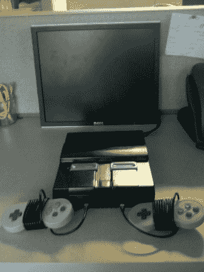

# SNES 模拟器有它的插槽密封关闭

> 原文：<https://hackaday.com/2012/10/19/snes-emulator-has-its-slot-sealed-shut/>

如果你仔细看，你会注意到这个超级任天堂系统上没有地方放游戏卡带。这是因为这是一款基于 Rasberry Pi 的 SNES 模拟器,它播放的是 rom，而不是卡带。由于 RPi 板被使用，你能玩的唯一限制是板的 RAM 和你在 SD 卡上的 rom。

该案件基本上已被掏空，未使用的墨盒槽密封一些邦多油漆前。除了 Rasberry Pi，您还会发现一个 7 端口供电的 USB 集线器和一个 Teensy 微控制器板。集线器允许控制器通过 USB 连接。Teensy 被认为是一个 USB HID 设备，用于将重置按钮连接到仿真器程序上的功能。电源开关仍然工作。为了实现这一点，[MIDItheKID]将一个 USB 连接器和一个 microB USB 连接器连接到电源开关上。我们认为这是从中枢获取能量，但我们不能 100%确定。

[MIDItheKID]在[中提到，Reddit 评论](http://www.reddit.com/r/DIY/comments/11pn7k/i_this_slick_retro_emulation_console_with_a/)说他正在考虑抓取那个有更多内存的[新 RPi](http://hackaday.com/2012/10/15/raspis-with-double-the-ram-in-the-wild/)并在他死去的 PSX 上做一些类似的工作。