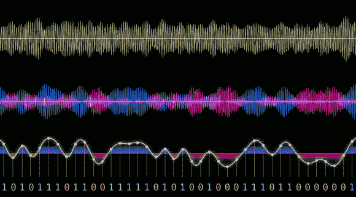

# 从无线电控制的公共汽车站显示中嗅探数据

> 原文：<https://hackaday.com/2013/11/25/sniffing-data-from-radio-controlled-bus-stop-displays/>

几周前，在芬兰[Oona]在一个调频广播中发现了一个以 76KHz 为中心的[无线电数据流，她](http://www.windytan.com/2013/11/broadcast-messages-on-darc-side.html)[最近设法解码了它](http://www.windytan.com/2013/11/decoding-radio-controlled-bus-stop.html)。这个 16,000bps 的数据流使用电平控制的最小频移键控( [L-MSK](https://en.wikipedia.org/wiki/Minimum-shift_keying) )，这种检测很难实现。因此，她通过将接收到的信号视为非相干二进制 FSK 来解码数据流，这作为副作用增加了比特错误概率。[Oona]然后了解到，她得到的数据流是 Helsinky buses 向附近公交车站时间表显示器广播的数据。她甚至幸运地观察到一个显示器卡在启动序列的中间，显示一个版本字符串。这表明该系统被称为 IBus，由瑞典公司 Axentia 制造。然而，他们的网站没有提供他们的专有协议的规格。经过几个小时的嗅探和编码，[Oona]成功地用 Perl 实现了五层协议栈，现在可以从她的公寓读取附近公交车的到达时间。