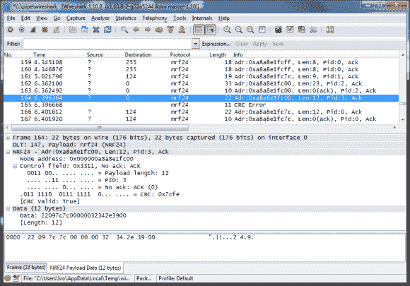

# 使用 Wireshark 嗅探 NRF24L01+流量

> 原文：<https://hackaday.com/2014/08/05/sniffing-nrf24l01-traffic-with-wireshark/>

我们确信我们的一些读者熟悉调试/嗅探 nRF24L01+通信的困难任务。嗯，[Ivo]开发了一个基于 Arduino Uno、单个 nRF24L01+模块和运行流行的网络协议分析器 Wireshark 的计算机的嗅探平台(他的文章中的[第一部分](http://yveaux.blogspot.nl/2014/07/nrf24l01-sniffer-part-1.html)、[第二部分](http://yveaux.blogspot.nl/2014/07/nrf24l01-sniffer-part-2.html)、[第三部分](http://yveaux.blogspot.nl/2014/07/nrf24l01-sniffer-part-3.html))。

由于这些非常便宜的模块不包括监听特定信道上发送的所有帧的混杂模式，[Ivo]在他的应用中使用了[[Travis Goodspeed]技术的变体](http://hackaday.com/2011/02/07/sniffing-rf-hardware-communication-packets/)来嗅探增强 Shockburst 消息。简而言之，它包括设置一个比通常更短的地址，设置一个固定的有效载荷长度，并禁用 CRC 功能。因此，连接到 nRF24L01+的 Arduino Uno 负责将嗅探到的帧转发到计算机。[Ivo]编写的一个应用程序解析接收到的数据，并将其转发给 wireshark，在 wireshark 上可以设置各种过滤器，只显示您感兴趣的信息。