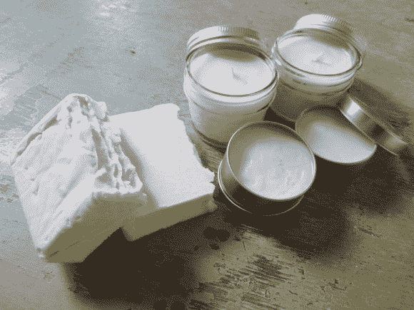

# 鹿脂肪制成的肥皂、蜡烛和化妆品

> 原文：<https://hackaday.com/2012/11/23/soap-candles-and-toiletries-from-deer-fat/>

这是一个更有生存主义天赋的黑客。【韧带】和一些朋友[用屠宰鹿的脂肪制作肥皂、蜡烛和化妆品](http://imgur.com/a/Fxf2I)。

狩猎季节到了，韧带的爸爸正在加工他收获的鹿。野生动物没有家养动物那么多脂肪，但还是有相当数量的。这群人在切剩下的肉之前，尽可能多的切下来。切边放入装有水的锅中，煮沸，直到脂肪开始上升。它被舀出来，用一些干酪布过滤。脂肪会在一夜之间变硬，可以作为一个大圆盘从容器中取出。它被重新加热，并通过网状咖啡过滤器过滤，以获得最终产品。从那时起，这种脂肪就被用作蜡烛、肥皂和润唇膏等产品的配料。详情请查看上面链接的图库中每张图片的评论。

浪费越少越好。但是一旦僵尸启示录来了，这个技能就不可或缺了。你可能还想知道如何给自己的水加氯。

[via [Reddit](http://www.reddit.com/r/somethingimade/comments/13n9yv/we_made_candles_soap_and_salve_from_deer_fat/)