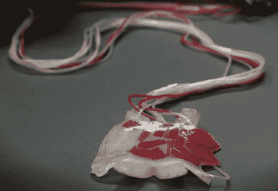

# 柔软的机器人被赋予了可以改变条纹的纹理

> 原文：<https://hackaday.com/2012/08/28/soft-robots-given-veins-the-let-them-change-their-stripes/>

如果它还活着，这个机器人将被归类为无脊椎动物。它没有脊椎，有趣的是，所有其他的骨头也不见了。开发它的哈佛研究人员称之为软机器人。它由硅树脂制成，并使用内置于物质中的路径来移动。通过[向这些路径添加压缩空气，附件相对于彼此弯曲](http://gmwgroup.harvard.edu/research/index.php?page=23)。事实上，休息之后你可以看到一个海星形状的软体机器人拿起一个鸡蛋的视频。

现在他们更进了一步。通过在顶部添加另一层，甚至将其嵌入体内，[机器人获得了变色的能力](http://news.harvard.edu/gazette/story/2012/08/soft-robots-go-for-color-camouflage/)。上面你可以看到一个柔软的机器人，开始时没有任何颜色(除了半透明的白色硅胶)，现在正在变成红色。随着染料的注入，它从右侧向左侧传播。该小组认为这在群体机器人的情况下可能是有用的。如果你有很多这样的东西在黑暗中寻找什么东西，当它们找到时，它们可以通过皮肤泵出发光的染料。跳完就可以看演示了。

拿起一个鸡蛋

[https://www.youtube.com/embed/csFR52Z3T0I?version=3&rel=1&showsearch=0&showinfo=1&iv_load_policy=1&fs=1&hl=en-US&autohide=2&wmode=transparent](https://www.youtube.com/embed/csFR52Z3T0I?version=3&rel=1&showsearch=0&showinfo=1&iv_load_policy=1&fs=1&hl=en-US&autohide=2&wmode=transparent)

改变颜色

[https://www.youtube.com/embed/bC1WFU4G-WU?version=3&rel=1&showsearch=0&showinfo=1&iv_load_policy=1&fs=1&hl=en-US&autohide=2&wmode=transparent](https://www.youtube.com/embed/bC1WFU4G-WU?version=3&rel=1&showsearch=0&showinfo=1&iv_load_policy=1&fs=1&hl=en-US&autohide=2&wmode=transparent)

[谢谢比尔]