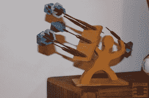
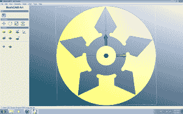
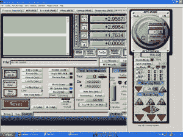

# 给任何考虑 CNC 路由器的人的软件建议

> 原文：<https://hackaday.com/2013/12/23/software-advice-for-anyone-thinking-about-a-cnc-router/>

**优秀的成绩可以来自一个小小的数控路由器，但不要忘了软件！**

**数控工具，无论其味道如何**，都可以大大提高你的“制造”或 DIY 能力。我目前选择的工具是 CNC 路由器。熟悉手动铣床，概念似乎相似，这些价格是相当合理的相比，其他一些工具。正如[在这篇帖子](http://hackaday.com/2011/09/01/building-a-cnc-router-to-call-my-own/ "building a CNC router to call my own") t 中所描述的，我的机器是一台 [Zen Toolworks 型号](http://zentoolworks.com/index.php?cPath=14&osCsid=6di2lsqecfiev4j2jlchg6n777 "Zen Toolworks CNC routers")，但肯定还有其他选项可以访问，比如这篇帖子中最近提到的[这款](http://hackaday.com/2013/12/05/fail-of-the-week-hackaday-writers-first-cnc-adventure/ "[Matheiu's] first CNC experience - Probotix fireball") [Probotix V90 型号](http://www.probotix.com/FireBall_v90_cnc_router_kit/ "Probotix FireBall V90 CNC router")。

尽管任何数量的 CNC 路由器模型在视频和图片中看起来都很棒，但请放心，即使是最好的机器也需要一些耐心才能令人满意地运行。设置机器可能是一个挑战，以及弄清楚你的机器能够做什么，但有一件事可能会让人们忘记，那就是所涉及的软件。继续阅读，找出~~你需要知道的一切~~幕后发生的事情“神奇地”产生有趣的部分。

有了由计算机(相对于专用控制器)运行的 CNC 路由器，你的工具链中就有了三个部分:计算机辅助设计 **(CAD)** ，计算机辅助制造 **(CAM)** ，以及**机器控制器**包。这些都有免费和付费版本。

## 设计你的角色

**Design [courtesy of ESTLcam](http://www.estlcam.com/messerhalter.php "Knife warrior") and my idea to shrink the knife block to make a [“warrior dart holder.”](http://www.jcopro.net/2013/02/09/warrior-dart-holder/ "wooden warrior dart holder")**

第一步是画出你的部分。为了生成零件图，我用矢量图形编辑器 [Inkscape](http://inkscape.org/en/download/ "Inkscape download") 和差不多是免费的 AutoCAD[draft sight](http://www.3ds.com/products-services/draftsight/download-draftsight/ "Draftsight download")进行了实验。Inkscape 是一个非常酷的程序，可以生成更多的艺术作品，比如我不久前砍掉的[这棵随机树](http://www.jcopro.net/2011/11/10/a-random-tree-made-with-inkscape/ "random tree made with Inkscape")。如果你想做一些维度驱动的事情，我首选的工具是 Draftsight。我对 AutoCAD 非常熟悉，Linux，Mac，Windows 都有。

如果你想进入 3D 设计，Sketchup 似乎或多或少是临时制作者/黑客等的标准。也许我已经被宠坏了或者被洗脑了，因为我发现 Sketchup 令人沮丧。我发现 Pro/E(现在的 Creo)有时也令人沮丧，但我为这种沮丧而付出。

不管你选择什么风格或设计程序，如果你不熟悉格式，计划花相当多的时间弄清楚如何生成你的部分。

## 生成 Gcode

**Meshcam screen [per my review](http://www.jcopro.net/2013/05/01/a-review-of-meshcam/ "MeshCAM review on JCoPro.net")**

g 代码，不像一些 90 年代中期的说唱歌手让你相信的那样，代表通用代码，是直接控制数控机床的代码。你可以手工编写 g 代码，对于非常简单的圆或线，这可能是实用的。然而，在大多数情况下，使用 CAM 程序将 CAD 模型转换成 g 代码格式更容易产生 g 代码。我已经试用了几个软件包，它们都有各自的优缺点:

*   [**gcode tools for Inkscape**](http://www.cnc-club.ru/forum/viewtopic.php?t=35 "Gcodetools Inkscape")——免费，非常适合在 Inkscape 上生成的艺术作品。能力有点有限，文档可能需要一点时间才能弄清楚。
*   [**estl cam**](http://estlcam.com/ "Estlcam")——价格低廉，35 美元，界面也很好看。更多的是 2D 环境，如果你喜欢，你可以在这个程序上画出你的部分。
*   [**CAMBam**](http://cambam.info/ "CamBam")——合理定价 149 美元，有非常好的免费试用期。我主要使用这个 CAM 程序。
*   **——看起来非常棒的用户界面，它有一些简洁的功能。除了这种抛光剂，它还比某些产品贵 250 美元。它更适合 3D 用户，所以不太适合我以 Draftsight 为中心的 CAD 风格。**
***   [**自定义 CAM 程序**](http://www.jcopro.net/2012/10/21/halftoning-or-pixel-machining-with-a-cnc-router/ "pixel machining with a CNC router")–如果你是一名程序员(或者假装是)，你可以编写自己的 Gcode 生成脚本。如果你想看一个例子，我已经链接了一个关于我的“像素加工”Python 例程的帖子。**

 **在实际学习软件的同时，你需要考虑你的机器实际上能处理什么样的速度，怎样做才不会让你的机器“崩溃”。CAM 程序是设置进给、速度、切削深度和其他参数的地方。

## 控制您的路由器

**Mach3 to control your router**

一旦你的 CAM 程序吐出可能几千行 g 代码，你的机器控制软件就是让一切运转的东西。我用的是 [Mach3](http://www.machsupport.com/software/mach3/ "Mach3") ，好像是业余爱好机控制的常用程序。像其他东西一样，它有一个学习曲线，但总的来说，我对它的表现很满意。

我遇到的一个缺点(其他程序可能也是如此)是，你需要一个实际的并行端口才能让它正常工作(不是 USB 并行适配器)，而且由于可能的电源管理问题，它不应该在笔记本上运行。我肯定有变通的办法，但是为了节省时间，最好还是重新使用(或者购买)一台旧电脑来运行它。它可以在略显陈旧的机器上舒适地运行，所以花 150 美元左右，你就可以拥有一台运行你的路由器的电脑。

另一个选择是 LinuxCNC。当我开始学习 CNC 时，我对 Linux 几乎完全不熟悉。学习一个新的操作系统和一个新的路由器的挑战似乎是一个太陡峭的学习曲线，所以我没有尝试这个选项。由于我现在经常使用 Ubuntu，我今天可能会选择不同的路线。如果你曾广泛使用 LinuxCNC，请在下面留言分享你的经验。

总结一下，这里有两个我制作的 CNC 视频。第一个是我雕刻老虎爪子，而第二个视频是我做的关于如何使用 Inkscape 雕刻标志的教程。一台数控机床对任何商店来说都是一个很好的补充，但是正如我希望我在这里指出的，不是没有挑战！

[https://www.youtube.com/embed/1yJmKhaOfwE?version=3&rel=1&showsearch=0&showinfo=1&iv_load_policy=1&fs=1&hl=en-US&autohide=2&wmode=transparent](https://www.youtube.com/embed/1yJmKhaOfwE?version=3&rel=1&showsearch=0&showinfo=1&iv_load_policy=1&fs=1&hl=en-US&autohide=2&wmode=transparent)

[https://www.youtube.com/embed/xa9bFHG-Ubw?version=3&rel=1&showsearch=0&showinfo=1&iv_load_policy=1&fs=1&hl=en-US&autohide=2&wmode=transparent](https://www.youtube.com/embed/xa9bFHG-Ubw?version=3&rel=1&showsearch=0&showinfo=1&iv_load_policy=1&fs=1&hl=en-US&autohide=2&wmode=transparent)

请注意，除了这篇文章之外，我还收到了特殊的定价和/或样品，以便试用来自 Zen Toolworks、Mach3、ESTLcam 和 MeshCAM 等公司代表的产品。

* * *

Jeremy Cook 是一名机械工程师，毕业于克莱姆森大学，从事制造业和过程自动化工作。此外，Jeremy 还是一名狂热的制作人和前 Hackaday 特约撰稿人。当他不在工作或车库时，你可以在他的推特@JeremySCook 、他的项目博客 JCoPro.net 或他的摄影相关博客 DIYTripods.com[上找到他。](http://diytripods.com/ "DIYTripods.com - Unique DIY ways to mount and use your camera")**