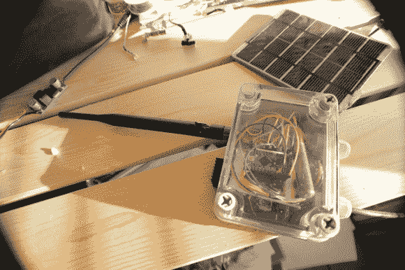

# 太阳能 Wifi 辐射传感器

> 原文：<https://hackaday.com/2013/01/03/solar-powered-wifi-radiation-sensor/>

[Manish]在这个[辐射传感器模块](http://theiopage.blogspot.ca/2013/01/solar-powered-wireless-autonomous.html "Radiation Sensor Module")中集成了许多功能。该设备完全由太阳能供电，不受天气影响，因此可以安装在任何地方。它使用盖革米勒管来监测辐射，并通过 wifi 网络连接到互联网来报告读数。

该设计使用 Arduino Pro Mini 来执行监控和报告。Wifi 连接由 RN-XV wifi 模块提供。太阳能电池板、Adafruit 的太阳能充电器和一个 LiPo 电池用于为该设备提供电力。它封装在 Adafruit 的 IP-66 级防风雨外壳中。

一个[定制盖革米勒管接口](http://theiopage.blogspot.ca/2012/09/simple-gm-tube-interfacing-to-arduino.html "Custom Geiger Muller Interface")用于与管接口。界面简单，价格便宜。它提供驱动电子管所需的高电压，以及检测电离事件所需的电路。

一旦设备连接到互联网，它就直接将数据上传到 [Cosm](https://cosm.com/ "Cosm") 。该服务允许使用 Twitter 共享数据，或者使用 API 访问数据。该项目展示了如何构建一个直接连接到互联网的无线网络传感器，价格约为 100 美元。