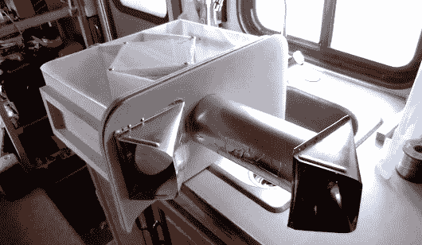
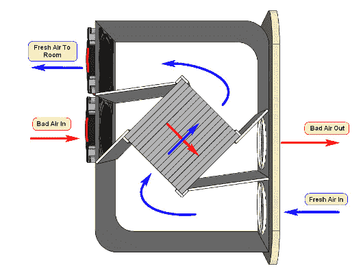
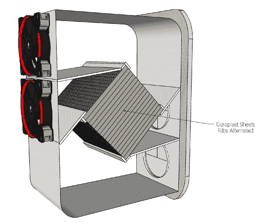

# 具有热回收的焊料烟雾提取器

> 原文：<https://hackaday.com/2013/12/08/solder-fume-extractor-with-heat-recovery/>

当雪覆盖了外面的风景，你尽最大努力保存里面的热量。[Tom]想出了一个聪明的设计[一个包含热回收通风器](https://www.youtube.com/watch?v=4FSewTEsGD8)的焊烟提取器。他创造了一个包含输入和输出部分的外壳。风扇用于引入外部空气，使其通过由 coroplast 交替面板制成的热交换器。(见休息后他的设置图)这真的是一个简单的设计，可以在几个小时内完成。

稍微挖掘一下就会发现一些关于制造这种热交换器的有用信息。[Tom]没有提到室内温度，所以很难计算他从中获得的效率。显然，根据热交换器的尺寸，它们可以达到 70%的热传递。

在视频中，[Tom]提到了一些可以做出的明显改进，包括更高效的风扇，以及更好的外壳，允许拆下核心进行清洁。不过，这是一个简单的设置，提供了一个很好的概念证明。也许将来我们会看到[汤姆]的一个更永久的装置。

 

[https://www.youtube.com/embed/4FSewTEsGD8?version=3&rel=1&showsearch=0&showinfo=1&iv_load_policy=1&fs=1&hl=en-US&autohide=2&wmode=transparent](https://www.youtube.com/embed/4FSewTEsGD8?version=3&rel=1&showsearch=0&showinfo=1&iv_load_policy=1&fs=1&hl=en-US&autohide=2&wmode=transparent)