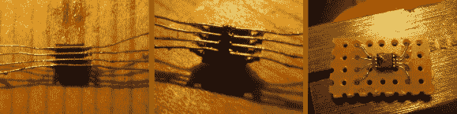

# 焊接技巧，让你自己的表面贴装分线板

> 原文：<https://hackaday.com/2013/06/25/solder-trick-to-make-your-own-surface-mount-breakout-boards/>

我们认为你真的会喜欢这个制作表面贴装分线板的技巧。通常使用电磁线将表面贴装器件的单个引脚连接到带引脚接头的试验板友好型原型板上。这里的新东西(至少对我们来说)是[Raul]将一根电线直接焊接到两个引脚上。

左图显示了一个 8 引脚器件，四根导线焊接到位。为了达到这一点，他首先将电线绑在一个工作面上，小心地将它们隔开，以匹配芯片引线的间距。然后，他用胶带将芯片固定到位，并将所有的腿焊接到电线上。这似乎是一举两得，因为将一根电线对准一条腿很困难。从那里，他把芯片翻转过来，切断芯片下面的电线。这使得将电线尾端焊接到一大块原板上的工作变得很容易。

它非常适合引脚数量较少的芯片。当然，你可能仍然需要[一个蚀刻的分线板](http://hackaday.com/2010/04/29/surface-mount-breakout-boards/)来处理大量的引线。