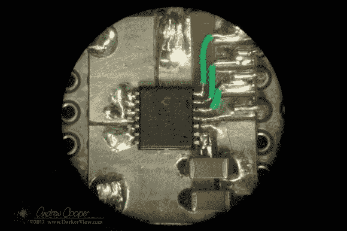

# 焊接视频 DA 的小元件

> 原文：<https://hackaday.com/2013/02/10/soldering-small-components-for-a-video-da/>

视频分配放大器用于放大视频信号，并将其分成多个输出，以便驱动多个显示器。它们还用于校正输入视频信号的增益。[Andrew]在处理来自干涉仪的视频信号时遇到了问题，并发现问题是由低输出增益引起的。他的解决方案是建立自己的[视频分配放大器](http://darkerview.com/wordpress/?p=7333 "A Video Distribution Amplifier")。

THS7374 似乎是这种应用的完美芯片。这是一款四通道视频放大器 IC，只需要几个无源元件即可运行。唯一的问题是封装:14 引脚 TSSOP，间距 0.65 mm。手工焊接并不好玩，尤其是如果你没有 PCB 的话。

[Andrew]的解决方案是用覆铜板打造自己的突围之路。他在显微镜下工作，并为零件切出一个图案，然后将 30 AWG 导线焊接到引脚上进行连接。在清除了任何可能导致短路的铜之后，电路板开始工作，视频波形在示波器上看起来很好。

经过测试，甚至需要更多的增益。[Andrew]最后级联了两个放大器。这种原型制作方法看起来并不容易，但是当你需要一个单板的时候，这种方法是值得的。