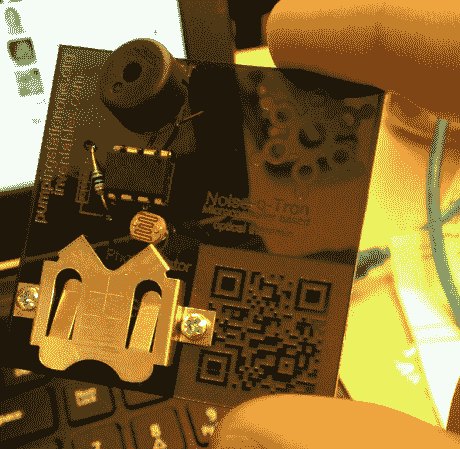

# 无焊噪音-o-Tron 套件在芝加哥制造厂制造噪音

> 原文：<https://hackaday.com/2014/05/13/solderless-noise-o-tron-kit-makes-noise-at-chicago-makerfaire/>

任何在活动中管理黑客空间展台的人都知道，向人们描述什么是黑客空间是多么困难。不管你用什么词来形容它，似乎没有什么能真正做到恰如其分。你不能简单地用语言让别人感受到当你学习新的东西和建造实际可行的东西时的成就感和乐趣。

[德里克]也有同样的问题，并决定[对此做点什么](https://github.com/loansindi/ps1_noise "github")。他意识到，为了真正分享黑客空间的体验，他必须把[黑客空间](http://pumpingstationone.org/2014/05/mini-maker-faire-or-how-i-annoyed-hundreds-of-people/ "Pumping Station One")的一部分带给人们。这意味着让人们建造一些简单但有趣的东西。[Derek]的设计必须足够简单，任何人都可以组装，并且足够便宜，可以在不倾家荡产的情况下适量生产。

[德里克]最终建造了一个简单的“光学特雷门琴”。这个简单电路的核心是一个 ATTiny45。Arduino 库已经移植到这个芯片上，所以[Derek]所要做的就是写几行简单的代码，然后他就可以运行了。芯片连接到一个光电池上，所以间距会随着到达光电池的光量而变化。然后，用户可以通过将他们的手移近或移远来改变音高，实现类似于特雷门琴的效果。

[Derek]用丙烯酸树脂设计了一个简单的“pcb ”,所有元件都用激光切割成孔。如果你没有激光切割机来切割亚克力板，你可以自己做一个。电子元件被放入孔中，导线简单地缠绕在一起。这使得即使是一个没有经验的建筑工人也可以在五到十分钟内完成工程，而不需要复杂的工具。他努力工作的最终结果是在许多快乐的新制造商那里有一个拥挤的摊位。所有[德里克]的计划都可以在 [github](https://github.com/loansindi/ps1_noise "github repo") 上获得，他希望他的项目能在全世界的创客节和黑客空间活动中派上用场。