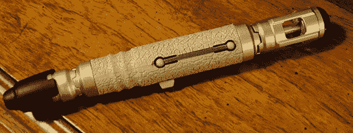

# 音速起子遇上电视-B-没了

> 原文：<https://hackaday.com/2013/03/16/sonic-screwdriver-meets-tv-b-gone/>

[furrysalamander]有一个朋友是一个真正的大医生迷。碰巧这位朋友的生日快到了，[furrysalamander]想给她一个惊喜。声波螺丝刀总是一件很棒的礼物，但[furrysalamander]想把他的个人风格融入其中。他最终在[10]的螺丝刀上加了一个 TV-B-Gone，把一个虚构的 deus ex machina 变成了一个实用的设备。

声波的主体来自 Think Geek 的螺丝刀的复制品。在内部，螺丝刀有空间来放置电池和电路板，以控制声波螺丝刀通常预期的灯光和声音。[furrysalamander]添加了一个由 ATtiny85、晶体管、LED 和一些电阻组成的自由电路，以添加关闭几乎任何电视的功能。

当然[furrysalamander]需要用 TV-B-Gone 固件对 ATtiny 进行编程，由于缺乏任何 AVR 开发工具，他使用 Raspberry Pi 的 GPIO 引脚将固件写入微控制器。这是我们以前见过的东西，但[furrysalamander]是一个冠军，因为他把这个过程包括在他的指令中。

最终的结果是一个声波螺丝刀，它不能在木头上工作，也不能打破死锁密封。不过，它可以很好地关闭电视，而且看起来很棒。休息之后，你可以看看[furrysalamander]的 sonic 的演示。

[https://www.youtube.com/embed/cUDJHyptKHY?version=3&rel=1&showsearch=0&showinfo=1&iv_load_policy=1&fs=1&hl=en-US&autohide=2&wmode=transparent](https://www.youtube.com/embed/cUDJHyptKHY?version=3&rel=1&showsearch=0&showinfo=1&iv_load_policy=1&fs=1&hl=en-US&autohide=2&wmode=transparent)