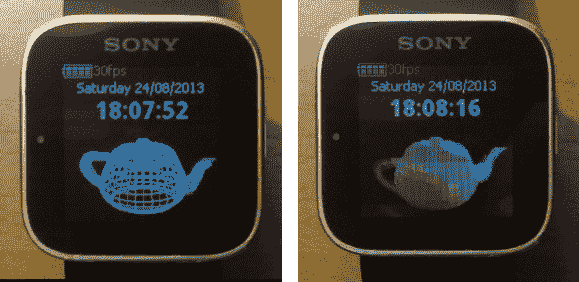

# 索尼智能手表 Hack 让它用茶壶动画来显示时间

> 原文：<https://hackaday.com/2013/08/26/sony-smartwatch-hack-lets-it-tell-time-with-a-teapot-animation/>

这个黑客把索尼智能手表变成了手表。从功能上看，它并不那么令人印象深刻。但是到达这一步的旅程代表了更多。这个例子展示了一个动画茶壶[，它使用了一个移植到设备](http://fedetft.wordpress.com/2013/08/24/tea-time-turns-your-smartwatch-back-into-a-watch-and-a-3d-rendering-engine/)上的 3D 渲染引擎。

[费德里科]在听说索尼发布了硬件开发的细节后，很快就开始了这个项目的工作。他深入研究了文档，但很快发现它缺乏处理裸机工作所需的深度。他把这个项目搁置了一段时间，直到遇到了我们在六月份报道的 Astrosmash 项目。它使用了一个允许 Arduino 草图在手表上运行的包装器。在研究了这是如何做到的之后，他有了足够的背景来移植这段代码。

我们仍然在等待看到一个真正创新的手表黑客。但是，我们很高兴看到像这样的每个新的概念证明的进展！

[https://player.vimeo.com/video/73119687](https://player.vimeo.com/video/73119687)