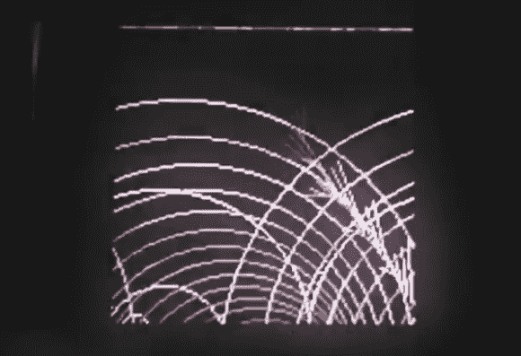

# 运行 Arduino 草图的索尼智能手表

> 原文：<https://hackaday.com/2013/06/22/sony-smartwatch-running-arduino-sketches/>

那没花多长时间。我们上周刚刚听说索尼邀请固件黑客为他们的智能手表，这里有一个早期的例子。上图是手表上运行的动画。它被写成运行在定制固件映像上的 Arduino 草图。[Veqtor]写了草图，它只是一对嵌套的循环，画出线条和圆圈。真正的问题在于固件本身。

[Veqtor]参加了[David Cuartielles]举办的研讨会([翻译](http://translate.google.com/translate?hl=en&sl=sv&tl=en&u=http%3A%2F%2Fstpln.se%2Fevent%2Farduino-and-sony-present-proof-of-concept-sony-smartwatch%2F))，邀请与会者在[的手表](https://github.com/dcuartielles/SmartWatch)固件黑客上测试他们的 Arduino 编码技能。它实现了一个 Android 解析器，但是开发还处于非常早期的阶段。目前他的自述文件中没有任何信息。但是回购的根目录有一个巨大的待办事项列表。仔细研究一下，看看能否找到他的代码来帮忙。

从[原始公告](http://hackaday.com/2013/06/14/hackit-sony-invites-you-to-hack-its-smartwatch-firmware/)中了解有关智能手表固件的更多信息。

[https://www.youtube.com/embed/QhcprEX_UVA?version=3&rel=1&showsearch=0&showinfo=1&iv_load_policy=1&fs=1&hl=en-US&autohide=2&wmode=transparent](https://www.youtube.com/embed/QhcprEX_UVA?version=3&rel=1&showsearch=0&showinfo=1&iv_load_policy=1&fs=1&hl=en-US&autohide=2&wmode=transparent)