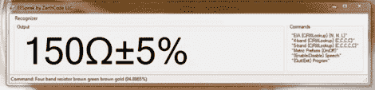

# 使用语音识别功能对电阻器进行分类

> 原文：<https://hackaday.com/2012/07/13/sorting-resistors-with-speech-recognition/>

如果你曾经不得不组织一群抵抗组织，你就会知道为什么[安东尼]创造了 EESpeak。这是一个声控元件查找工具，通过听你读出颜色代码带来计算元件值。

在 EESpeak 的演示视频中，[Anthony]读出了几个电阻的色带，同时程序忠实地计算并显示数值。[Anthony]还支持通过说出色带来计算电容和电感的值，以及 SMD 器件的 EIA-96 代码。

除了接受语音输入并在屏幕上显示元件值之外，EESpeak 还具有文本到语音转换功能，可以告诉您元件是什么，而无需查看您的显示器。

尽管文本到语音转换功能看起来有点麻烦——计算机说出一个值比在屏幕上显示它需要的时间长得多——但使用语音识别来计算组件值是一个很棒的想法。由于计算机必须理解的词汇极其有限，所以 EESpeak 的错误率可能非常低。

休息过后，你可以看看[Anthony]的演示视频，当然也可以在他的博客上下载这个应用。

[https://www.youtube.com/embed/jC6-MWISfbY?version=3&rel=1&showsearch=0&showinfo=1&iv_load_policy=1&fs=1&hl=en-US&autohide=2&wmode=transparent](https://www.youtube.com/embed/jC6-MWISfbY?version=3&rel=1&showsearch=0&showinfo=1&iv_load_policy=1&fs=1&hl=en-US&autohide=2&wmode=transparent)