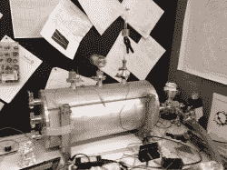

# 西南之旅:亚利桑那州梅萨的热同步实验室

> 原文：<https://hackaday.com/2012/08/09/southwest-tour-heatsync-labs-in-mesa-arizona/>

[https://www.youtube.com/embed/zTj7kgsIfrA?version=3&rel=1&showsearch=0&showinfo=1&iv_load_policy=1&fs=1&hl=en-US&autohide=2&wmode=transparent](https://www.youtube.com/embed/zTj7kgsIfrA?version=3&rel=1&showsearch=0&showinfo=1&iv_load_policy=1&fs=1&hl=en-US&autohide=2&wmode=transparent)

随着气温上升到大约 117 度，我们抵达亚利桑那州的梅萨，参观热同步实验室，这是我们在 T2 西南之旅 T3 的一部分。事实上，我们过去已经参观过 Heatsync，你也许应该[回头参考一下，快速浏览一下这个设施](http://hackaday.com/2012/05/02/hackerspace-intro-heatsync-labs-in-mesa-arizona/)。当我在那里的时候，有太多的东西要看和谈论，以至于视频结束时超过了 10 分钟，我觉得我们只是触及了事情的表面。

看看上面的视频，看看一些东西，像巨型激光切割机，电子显微镜，一些模具制作，beat lab(称为“Beatsync”)和 3d 打印。我们简短地参观了工厂，但主要是让人们告诉我他们在做什么。

我不得不称赞他们，整个旅途中，我的儿子们都很失望，因为他们在到处都有的旅游景点钥匙链上找不到他们的名字。Heatsync 的人通过切割一些印有他们名字的定制钥匙链来弥补这一缺陷。

