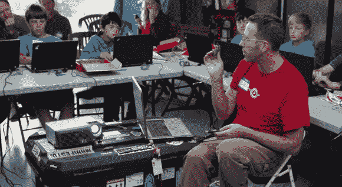

# SparkFun 带着他们的教育节目上路了

> 原文：<https://hackaday.com/2013/03/05/sparkfun-takes-their-educational-show-on-the-road/>

他们买了一辆房车，正带着装满业余爱好电子硬件的水桶前往你所在的州。这是 SparkFun 的全国教育之旅，如果你想让他们为你所在地区的孩子举办一个研讨会，现在是报名的时候了！

毫不夸张地说，我们的日常生活与技术紧密相连。这张照片中的每一个孩子都有可能在他们上中学的时候(如果不是更早的话)在他们的口袋里带着嵌入式系统到处走(说真的，他们中的许多人都有最新一代的高端智能手机)。可悲的事实是，几乎 100%的人永远不会知道这些设备中的硬件是如何工作的。这就是我们认为这个项目真正闪光的地方。

SparkFun 正在安排 50 个站点，补贴 1000 美元的费用。该团队将与每个学校/组织合作，针对学生的年龄和他们在该主题上的基础知识举办适当的研讨会。希望这将激励新一代的硬件黑客，他们最终将有助于使用技术来解决世界问题。跳完之后看看他们的宣传片。

我们提到了补贴访问。这个项目的费用仍然是 1500 美元，前 50 站后会涨到 2500 美元。但是车间里使用的硬件和孩子们在一起。我们希望每个人 37.50-125 美元的价格标签将被视为一项值得的投资，让孩子们对在硬件上运行的社交媒体产品感兴趣，而不仅仅是自娱自乐。

[https://www.youtube.com/embed/GcrTOUR0G1c?version=3&rel=1&showsearch=0&showinfo=1&iv_load_policy=1&fs=1&hl=en-US&autohide=2&wmode=transparent](https://www.youtube.com/embed/GcrTOUR0G1c?version=3&rel=1&showsearch=0&showinfo=1&iv_load_policy=1&fs=1&hl=en-US&autohide=2&wmode=transparent)