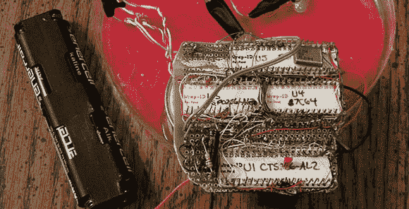

# 1991 年的语音合成瓦伦丁

> 原文：<https://hackaday.com/2013/02/18/speech-synthesizing-valentine-from-1991/>

早在 1991 年，一个年轻的(边远地区的工程师)和他的新婚妻子在情人节聚会。聚会的条件之一是让男士们制作——而不是购买——情人节贺卡。他想，要么做大，要么回家。几天后，他有了一张会说话的情人节卡片，这将成为他妻子最珍贵的财产之一。

90 年代初是一个不同的时代；如果你今天还没有感到自己很老，1991 年比 2013 年更接近 1970 年。同样，这个发自内心的表达感谢的符号内部的电路更像 20 世纪 70 年代的电子杂志，而不是今天的 Arduino 项目。

该项目由一个旧的英特尔 MCS-48 微控制器驱动，该微控制器附在 Radio Shack 曾经出售的一个旧的语音合成芯片上。它们依次连接到一个可编程逻辑芯片和一个屏蔽 ROM，后者将英语单词翻译成音素，供语音合成器使用。

整个设备是建立在一块裂开的 perf 板和几个绕线插座上的；坚固的结构，即使电池盒已经更换了几次。

至于会说话的情人说了什么？”“好吧！你好，我是一张会说话的情人节卡片。“爱是一种非常美妙的东西”，在这种情况下，也需要电池！“休息之后你可以去看看。

 [https://www.youtube.com/embed/nZ0rkK6c9zA?version=3&rel=1&showsearch=0&showinfo=1&iv_load_policy=1&fs=1&hl=en-US&autohide=2&wmode=transparent](https://www.youtube.com/embed/nZ0rkK6c9zA?version=3&rel=1&showsearch=0&showinfo=1&iv_load_policy=1&fs=1&hl=en-US&autohide=2&wmode=transparent)