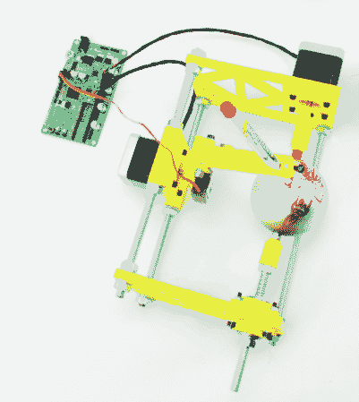

# sphereboot:装饰圣诞饰品

> 原文：<https://hackaday.com/2013/12/25/spherebot-decorating-xmas-baubles/>

Spherebot 是一款开源机器，能够将设计打印到球形物体上，比如圣诞挂件！

这个设计是基于一直很受欢迎的鸡蛋机器人，我们已经看到它被衍生到许多其他有用的打印机中，比如 T2 马克杯绘图仪和 T4 乒乓球打印机。

Spherebot 具有两个步进电机，一个用于标记驱动的伺服电机，一些廉价的安装硬件和一大堆 3D 打印部件——所有这些都可以在 [Thingiverse 上获得。](http://www.thingiverse.com/thing:201052)在这个设计中，他们使用了一个由 Open-Electronics 开发的名为 [3Drag](http://store.open-electronics.org/3D/3D_electronics/3D_controller) 的 3D 打印机控制器板，它基于 ATmega2560(与 Arduino MEGA 相同的微控制器)。Spherebot 不需要所有三个轴或挤压机，因此他们只在板上安装了 4 个步进驱动器中的 2 个，以节省成本。

一旦你完成了这一切，把你的设计上传到 GitHub 上提供的免费的 Spherebot-Host-GUI 就很简单了。休息后留下来看看它能做什么！

[https://www.youtube.com/embed/Ofufxmm6wd4?version=3&rel=1&showsearch=0&showinfo=1&iv_load_policy=1&fs=1&hl=en-US&autohide=2&wmode=transparent](https://www.youtube.com/embed/Ofufxmm6wd4?version=3&rel=1&showsearch=0&showinfo=1&iv_load_policy=1&fs=1&hl=en-US&autohide=2&wmode=transparent)

[via [危险原型](http://dangerousprototypes.com/2013/12/19/spherebot-reloaded-customize-your-xmas/)