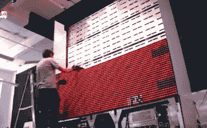
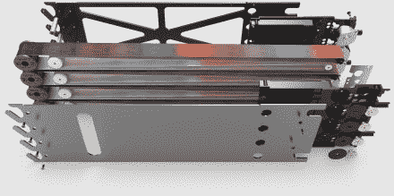

# 用于 6400 像素彩色显示器的线轴

> 原文：<https://hackaday.com/2015/07/22/spools-of-thread-for-6400-pixel-color-display/>

这不是 LED 显示屏，是线程显示屏。布鲁克林的快速产品和原型公司“早餐”的硬件艺术家[为每个像素使用线轴](http://breakfastny.com/f21-thread-screen-press-release)建造了这个彩色显示器。准确地说是 6400 个线轴。

  Loading modules into the display  Pixels use long strips for the colors

认真的工作投入到这件事里，结果好得不能再好了。休息过后，请观看视频，亲自体验。诀窍是增加线轴的表面积。这是通过使用线轴作为滑轮来引导 5.5 英尺长的“螺纹织物”来实现的。近看，这种面料看起来好像只是缠绕在木制线轴上，但额外的长度为 36 种不同的颜色提供了足够的空间，每种颜色都以渐变效果融入下一种颜色。索引每个像素系统中织物的位置，你就有了广泛的颜色选择。

这件作品是服装零售商 Forever 21 委托制作的，[甚至有了自己的网站](http://f21threadscreen.com/)。显示器拉取带有#F21threadscreen 标签的 Instagram 照片并显示。你可以在下一周[观看一个直播流](https://www.youtube.com/watch?v=Staau2OCVuY)，专用网站有一个搜索功能，可以通过用户名找到你自己的照片记录。

我们必须再次肯定制作了我们想看的广告。这既有趣又牛逼。它给了一些有才华的人制作它的工作，分享构建的细节对我们来说既有趣又鼓舞人心。想看一些更有趣的类似这样的广告吗？看看那个用作留声机圆筒的[贝克的瓶子](http://hackaday.com/2013/06/13/becks-beer-bottle-sound-recording/)，还有那个用来分离奥利奥的[极限工程](http://hackaday.com/2013/03/05/oreo-separators-episode-2-chucks-food-at-your-face/)。

[https://www.youtube.com/embed/dvDHNDkO-Qo?version=3&rel=1&showsearch=0&showinfo=1&iv_load_policy=1&fs=1&hl=en-US&autohide=2&wmode=transparent](https://www.youtube.com/embed/dvDHNDkO-Qo?version=3&rel=1&showsearch=0&showinfo=1&iv_load_policy=1&fs=1&hl=en-US&autohide=2&wmode=transparent)