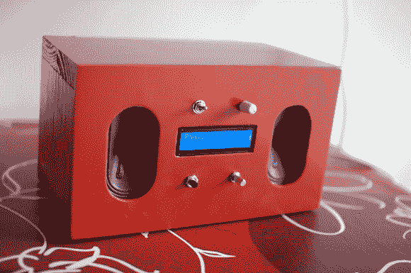

# squeeze berry:Raspberri Pi 驱动的 Squeezebox 设备

> 原文：<https://hackaday.com/2013/04/13/squeezeberry-a-raspberri-pi-powered-squeezebox-appliance/>

我们喜欢[Emmanuel]用他的基于 Raspberry Pi 的 Squeezebox 客户端实现的外观。它有极简主义倾向，使它乍一看像一个商业产品。但是再看看没有格栅的扬声器、字符 LCD 和实用的按钮、旋钮和开关，我们会发现它充满了我们熟悉和喜爱的硬件。

自从罗技宣布终止 Squeezebox 生产线以来，我们已经看到了几个接过火炬的项目。我们已经看到了用作 Squeezebox 服务器的 RPi 和用作客户端的几个 T2 嵌入式 Linux 系统。这是跟随后者的脚步。RPi 正在运行 Raspbian，而[squeeze lite 包](https://code.google.com/p/squeezelite/)处理与他的服务器对话所需的位。前面的控件包括电源开关、旋转编码器和用于导航菜单的按钮，以及调节 HD44780 LCD 屏幕对比度的电位计。扬声器是一组从机箱中解放出来的放大 PC 扬声器，安装在构成外壳的木箱内。正在进行的拍摄看起来很粗糙，但一些打磨和绘画真的把一切都结合在一起了。如你所料，我们已经在跳转后嵌入了演示视频。

[https://www.youtube.com/embed/MlwlagkwlYU?version=3&rel=1&showsearch=0&showinfo=1&iv_load_policy=1&fs=1&hl=en-US&autohide=2&wmode=transparent](https://www.youtube.com/embed/MlwlagkwlYU?version=3&rel=1&showsearch=0&showinfo=1&iv_load_policy=1&fs=1&hl=en-US&autohide=2&wmode=transparent)