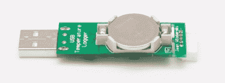

# 独立 USB 温度记录器

> 原文：<https://hackaday.com/2012/05/15/standalone-usb-temperature-logger/>

[Jean]写道渴望分享他的最新项目，一个带 USB 连接的独立温度记录器。[回到 11 月，](http://pickandplace.wordpress.com/2011/11/14/designing-a-simple-and-cheap-temperature-logger-part-1/)【吉恩】发现自己想要一个大概只有 u 盘大小的温度记录仪。他在市场上找到的东西在价格和尺寸上都不太合适，所以他决定自己设计。他的将是他想要的大小，不需要任何软件或驱动程序来运行。您只需插入它，编辑配置文本文件来设置您的时间间隔，然后就可以开始了！

你可以在他的网站上跟踪整个设计和制作过程。他非常善于讨论他为什么做出每个决定，以及他是如何解决遇到的任何错误的。你可以在他的网站上下载原理图和源代码。

[https://www.youtube.com/embed/RMFjNDHFCKY?version=3&rel=1&showsearch=0&showinfo=1&iv_load_policy=1&fs=1&hl=en-US&autohide=2&wmode=transparent](https://www.youtube.com/embed/RMFjNDHFCKY?version=3&rel=1&showsearch=0&showinfo=1&iv_load_policy=1&fs=1&hl=en-US&autohide=2&wmode=transparent)