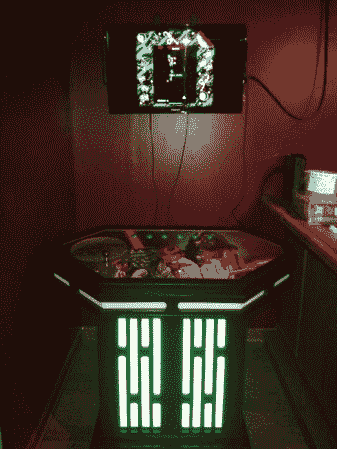

# 星球大战主题的 MAME 橱柜是这个地下室酒吧的完美之选

> 原文：<https://hackaday.com/2013/01/08/star-wars-themed-mame-cabinet-is-perfect-in-this-basement-bar/>

《星球大战》系列的粉丝会立即认出这些发光的竖条是原版电影风格的一部分。他们装饰了这家酒吧最近安装的 MAME 橱柜。你不得不承认，它看起来太棒了。但是我们总是在寻找构建日志，而[这个带注释的 46 映像集](http://imgur.com/a/VDqrY/layout/blog)不缺好东西。

这个项目从一个非常普通的胶合板框架开始。但随着圆形格栅被添加到盒子上，它很快就成形了。它们后面被切割了一些孔，以接受作为扩散器的丙烯酸树脂，并允许 led 从内部透过。将来会有几个架子用来存放额外的游戏系统。目前，里面只有一台运行模拟器的相当强大的计算机，允许通过街机按钮或使用无线 Xbox 控制器玩游戏。

确保您一直到达构建图像的末尾。我们对街机按钮中的自定义图标感到高兴。代替常见的玩家一和玩家二图像的是星球大战人物和物体的轮廓。这种对细节的关注真的让这个建筑与众不同！

[谢谢杰森]