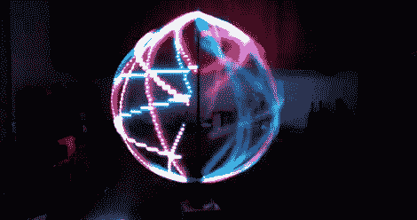

# 星际之门打蛋器

> 原文：<https://hackaday.com/2012/09/24/stargate-eggbeater/>

[Jason]使用一条 142 个 Adafruit LPD8806 可寻址 RGB LEDs 来创建[星际之门打蛋器](http://stargateeggbeater.com/index.php/videos "StarGate Eggbeater")视觉持续显示。led 灯条由 Arduino Mega 控制，Arduino Mega 用于控制灯条，并为每个 LED 提供 21 位颜色控制。该条带被容纳在环形管中，该环形管安装在杆和轴承上以允许其旋转。使用 1/4 马力的马达以 250 转/分的速度旋转戒指，产生 POV 效果。

控制旋转物体时的一个问题是与旋转物体进行电连接。LPD8806 需要四个连接:电源、地、时钟和数据。为了进行连接，[杰森]使用了一个[穆格滑环](http://www.moog.com/products/slip-rings/ "MOOG Slip Rings")。这允许在环以 250 RPM 旋转时进行四个连接。

当然，POV 演示需要视频，所以休息后请查看“boss 计划”视频。

通路〔t0〕adafruit〔t1〕

[https://www.youtube.com/embed/_wqIyxzFOIU?version=3&rel=1&showsearch=0&showinfo=1&iv_load_policy=1&fs=1&hl=en-US&autohide=2&wmode=transparent](https://www.youtube.com/embed/_wqIyxzFOIU?version=3&rel=1&showsearch=0&showinfo=1&iv_load_policy=1&fs=1&hl=en-US&autohide=2&wmode=transparent)