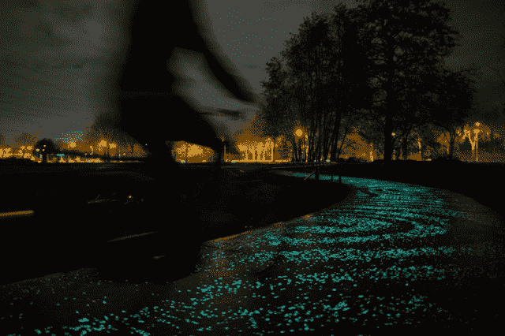

# 荷兰星光大道点亮夜晚

> 原文：<https://hackaday.com/2014/11/13/starry-walkway-in-the-netherlands-lights-up-the-night/>

当功能工程与设计和美学融为一体时，我们在日常生活中遇到的事情会让世界变得更加精彩。艺术家，[金奎大·罗斯加德的] *太阳能供电的*走道昨晚在荷兰的纽南亮相，[用旋转的灯光照亮了一公里长的走道](http://www.dezeen.com/2014/11/12/daan-roosegaarde-van-gogh-bicycle-path-glowing-patterns-nuenen-netherlands/)，用功能性在视觉上改变了空间。

如果蓝色和绿色的流动螺旋看起来很熟悉，那是因为它们受到文森特·梵高的油画《星夜》的启发，梵高一生中有一部分时间是纽南的居民。沿着道路排列的马赛克形状涂有一种特殊的涂料，这种涂料含有一种化学物质，可以吸收太阳光，从而在夜间有效发光长达 10 个小时。

该项目是【Roosegaarde 工作室】[智能公路研究](http://www.dezeen.com/2013/03/21/smart-highways-by-studio-roosegaarde/)的第二部分；其更大的目标是以艺术灵感的方式将新技术与道路结合起来，使通勤更安全、更节能。在其他一些类似的激励措施中，[Roosegaarde]设想将这种发光涂料用于道路标记，作为一种帮助取代路灯的手段。他提出的涂料涂层还将对温度敏感，并能够产生图像，以向司机指示何时可能因结冰而出现冰。他对升级道路的想法包括优先车道，可以通过内置在电动汽车下方的感应线圈为电动汽车充电。更酷的是，[Roosegaarde]还提出了改造树木的可能性，使其包含一些水母和蘑菇的生物发光特性，这样它们也可以帮助取代昂贵的室外人造光。由于其中一些技术将在未来几年内在荷兰的部分地区实施，重新设想的环保未来很可能看起来像一幅画中的幻想场景。

[https://www.youtube.com/embed/wEe8firurCY?version=3&rel=1&showsearch=0&showinfo=1&iv_load_policy=1&fs=1&hl=en-US&autohide=2&wmode=transparent](https://www.youtube.com/embed/wEe8firurCY?version=3&rel=1&showsearch=0&showinfo=1&iv_load_policy=1&fs=1&hl=en-US&autohide=2&wmode=transparent)