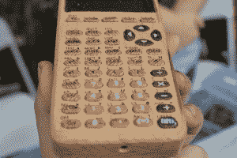
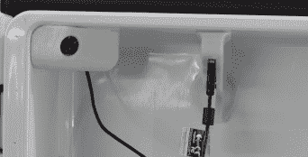
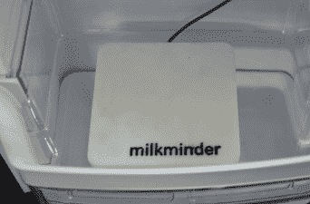
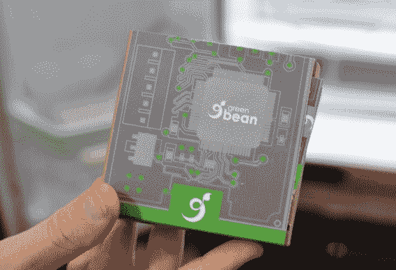
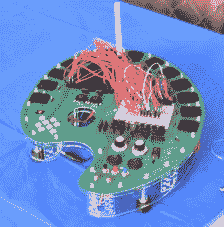
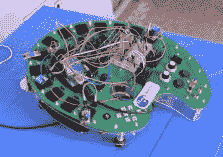
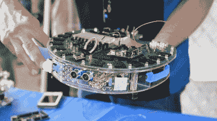
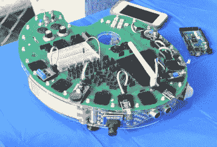

# 创客节开始了

> 原文：<https://hackaday.com/2014/09/26/starting-to-wrap-up-maker-faire/>

纽约创客节已经过去将近一周了，现在是我们开始总结我们所看到的一切的时候了。

【克里斯·米歇尔】，来自 [Cemetech](http://www.cemetech.net/) 的 hackaday favorite 做了他在 Maker Faire 总是做的事情:带来一些他正在用 TI 图形计算器做的东西。

带 GPS 的 TI-84 和图形计算器 IRC 客户端都做了展示。迄今为止，看起来最酷的计算器是木制的 casemod。这是一个 TI-82 放入一个枫木外壳(感觉和外观都像)。按钮是画上去的，尽管把消费电子产品装进了手工制作的盒子里，它仍然是相当便携的。

集会上有更多的黑客粉丝，但我不确定是否有人能打败来自 [Protopalette](http://www.protopalette.com/) 的家伙。等等。一个人可以。有时间在公共场合找到我，我会告诉你的。

Protopalette 是一个板，上面有一堆灯、按钮、开关、传感器、旋钮、伺服系统和蜂鸣器，用于电子原型制作。你可以把它看作是老式的“零件、弹簧和电线”无线电初学者电子工具包的程式化版本。

一些有着最疯狂群体故事的黑客空间成员，路易斯维尔的 LVL1 来到了集会现场。他们正与通用电气合作，为家电产品打造一个“制造商模块”。它被称为[青豆](https://firstbuild.com/greenbean/)，通用电气实际上正在他们的一些冰箱、洗衣机、炉子和洗碗机中构建对这一技术的支持。

已经有几个模块了，比如当你没有牛奶时会发出信息的秤。这是一个有趣的系统，已经有很多设备支持该系统。

下图。

                       