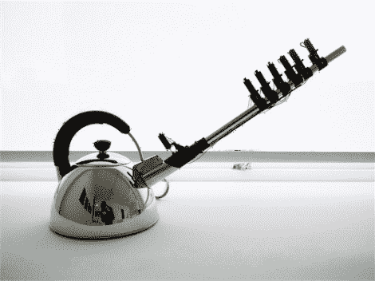

# 蒸汽管道

> 原文：<https://hackaday.com/2012/04/18/steam-fife/>

这个[自动笛子是用蒸汽](http://yurisuzuki.com/works/musical-kettle/)吹的。好吧，当音孔被一组螺线管打开和关闭时，电也有它的作用。

我们不知道声音实际上是如何产生的。我们会认为这里使用了一便士哨子，除非是这样，否则最靠近水壶的螺线管就没有用了。同样，在休息后看了演示后，我们不确定它是否有太大的影响。这可能是为了停止声音，但它并不真的工作得很好。

无论如何，我们希望看到一些衍生的黑客技术。假设塑料可以承受蒸汽的热量，这将是一个完美的机器人控制器，用于[记录器控制的蛇](http://hackaday.com/2012/04/03/recorder-controlled-snake-game-played-on-a-nokia-6110/)。你可以在一元店买到一美元的录音机，而[螺线管可以由简单的材料制成](http://hackaday.com/2010/12/02/make-your-own-solenoids-then-play-the-xylophone/)。如果你知道一种自己制造声音的方法，所有需要做的就是[一些仔细的计算来放置音孔](http://www.phy.mtu.edu/~suits/fingers.html)。

[https://player.vimeo.com/video/10380444](https://player.vimeo.com/video/10380444)

[通过[压力器](http://presurfer.blogspot.com/2012/04/musical-kettle.html)