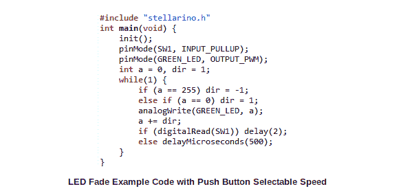

# Stellarino 为 Stellaris Launchpad 带来了接线式编码

> 原文：<https://hackaday.com/2012/12/19/stellarino-brings-wiring-style-coding-to-the-stellaris-launchpad/>

[苏丹卡西姆]来信告诉我们他在斯特拉里诺图书馆所做的工作。它的目标是为那些希望从 Arduino 迁移到 ARM 的人打破编码障碍。这是通过[简化 Stellaris Launchpad](http://stellarino.blogspot.ca/2012/12/stellarino-04-release.html) ARM 开发板的布线代码来实现的。

立刻[Sultan]提到该接口类似于布线，但与之不兼容。这意味着你不能只是把你现有的草图放到一个 C 文件中，然后通过添加一个简单的包含文件来让它们工作。但它确实提供了经验丰富的 Arduino 用户已经习惯的功能。上面可以看到一些例子，包括 analogWrite()、digitalRead()和一个简单的延迟函数。

我们匆匆看了一下图书馆。它使用存储在芯片 ROM 中的 StellarisWare 组件(这些组件都以“ROM_”开头)。唯一缺少的是 UARTstudio 库，它显然带有与 GPL 不兼容的许可证。