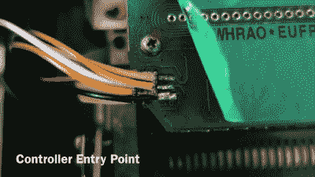
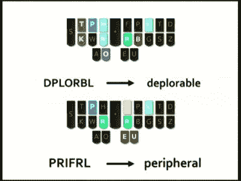
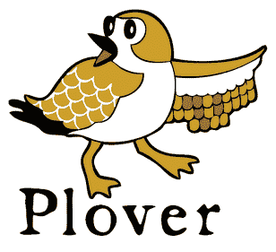
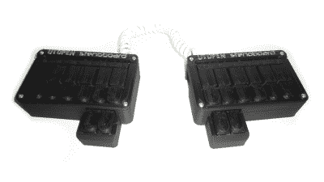

# 速记(是的，使用 Arduinos)

> 原文：<https://hackaday.com/2015/07/06/stenography-yes-with-arduinos/>

最快的键盘是什么？在极客社区，很少有话题会引起如此大的分歧。Clicky 还是 squishy？QWERTY 还是德沃夏克？老派的 IBM 还是微软 Natural？答案是:以上都不是。

最快的普通键盘打字员(德沃夏克或 Qwerty)每分钟能打出大约 220 个单词。这听起来很快，比我们打字的速度快得多，但仍低于持证法庭记录员或隐藏字幕员的最低速度。最快的法庭记录员每分钟大约记录 350 到 375 个证词。但他们是通过作弊来做到这一点的——使用速录机。我们一会儿将更多地谈论速记，但首先是一个黑客。

## 特雷·哈克

[凯文·尼加德]从易趣上买了一台二手 Stentura 200 速录机，但它不能正常工作，所以他很自然地把它打开，看看是否能修好。一台普通的速录打字机可以独立工作，在纸带上打印出来，但许多也可以连接到外部计算机上。[Kevin]的机器安装了一个串行输出板，但它不输出串行，所以他很自然地打开它，看看他是否能修复它。最后，他通过在 Arduino 上焊接[并编写几行代码](https://github.com/balthamos/steno-arduino)绕过了串行输出。

 【凯文】机器中的串行接口板基本上是一组当按键被按下时与之接触的开关，以及一些通过串行连接读出这些开关状态的移位寄存器。[Kevin]接入这条线路，将开关状态读入他的 Arduino，然后通过 Arduino 的 USB 串行接口将正确的字符传输到他的计算机。([视频演示](https://www.youtube.com/watch?v=ccxri4A-SbM))正如硬件类型喜欢说的，剩下的就是软件的简单问题了。

## 速记 101

我们是大键盘爱好者。也许 Hackaday 三分之一的内容是在一台或另一台老式 IBM 型电脑上打出的，没有一个以打字为生的自尊的极客没有一种近乎宗教般的键盘偏好。[Kevin]简单的黑客行为让我们注意到我们从未报道过速记。(不是[隐写术](https://en.wikipedia.org/wiki/Steganography)。)坦白地说，我们很惭愧，我们现在正在解决这个问题。

 速记速度的秘密在于使用一个[合音的、符合解剖学设计的键盘和一个伴随的语音助记速记系统](https://en.wikipedia.org/wiki/Stenotype)。基本上，一个人把与单词的声音相对应的键混在一起，并根据带有用户可扩展字典的助记系统来解释它们。简而言之，就是机器辅助打字。

许多单词是一个和弦，有数百万个可能的和弦，所以有足够的空间来根据需要添加自己的组合键。

但是因为速记是一个利基市场，因为速记机是为闭路字幕员和法庭记录员设计的，所以速记机要花费数千美元。运行它们的软件也不便宜，而且是为非常特殊的目的而写的，当然是专有的。简而言之，这个市场只迎合专业人士，直到最近，速记爱好者的空间都不大。

## Plover:开放软件

 [Plover](http://stenoknight.com/wiki/Main_Page) 是免费开源的速记软件( [Github](https://github.com/openstenoproject/plover) )，目标是成为速记门户药物。具体来说，Plover 可以通过软件将一个普通的键盘(支持和弦的 n 键翻转)变成一个模拟的速记键盘，允许以一百美元而不是几千美元进入速记世界。

Plover 还将与支持串行输出的专业速记系统一起工作，就像[Kevin]修改的那个最初把我们送进这个兔子洞的速记系统。因此，一旦你迷上了速记，如果你愿意，你可以使用你辛苦赚来的硬件改进的字典。

注意， [n 键翻转](http://stenoknight.com/wiki/N-key_rollover)要求是有约束力的，这就是 100 美元的来源。你可以很容易地在速记机上和弦 20 个键，因为每个手指下面有两个按钮，和弦系统被设计成一次敲击两个按钮。一些游戏键盘有足够的翻转能力，但这不是未洗过的大众所需要的功能。简而言之，n 键翻转要花一点钱，或者你可以自己动手。(提示，提示。)

如果你以前使用过替代键盘(或者只是键盘映射)，你会知道它们的致命弱点是如何处理你最喜欢的编辑器或 IDE 要求你使用的命令和控制字符。我们有这个手持设备，这使得几乎不可能键入 control-x control-s，所以它是再见键盘或再见 Emacs。

这不是速记设备的问题，因为您可以定义自己的和弦映射。但是，您不必停止使用控制字符甚至 Unicode。将和弦映射到常用的变量名。将弦映射到整个流控制结构骨架(if-then-else)。把速记笔画想象成输入宏指令，你就明白了。

Plover 的领导者[Mirabai Knight]有大量关于入门的信息，包括一个[现场浏览器演示](http://stenoknight.com/kws.html)(一定要试试！)和一个演示 Python 的[视频(以及其他内容)](https://www.youtube.com/watch?v=Wpv-Qb-dB6g&t=6m20s)，在这里你可以看到 chording 如何与编码一起工作。如果你想看看[Mirabai]如何使用 Plover 和 Vim 为客户现场转录，[这个视频和它的侧窗格](https://www.youtube.com/watch?v=MuVUGKBOp9Q)是幕后的一个很好的窥视。

## 开放斯特诺项目:硬件

开放斯特诺项目是 Plover 之上的一个伞状项目，旨在减少硬件和理论学习障碍。他们列出了三种键盘选项。

Ergodox 似乎只是一个奇特的符合人体工程学的分离式键盘，但它特别适合速记。

[狭龙](http://stenosaurus.com/)(硅谷式的空注册页面提示)看起来很性感。速记龙由[Josh Lifton]运营，Plover 背后的原始编码重量级人物，他最近众筹了一批轻量级和安静的按键开关，给了我们希望。但是希望和 4.35 美元可以给你买一杯双泵豆奶香草拿铁；我们喜欢看到工作进展。

 相比之下，[速写板](http://stenoboard.com/)是一个开放的项目，有实际的设计、3D 打印的案例、代码和项目实例。[固件](https://github.com/caru/StenoFW)运行在 Arduino 上。StenoSpeak，一个基于 Stenoboard 的应用程序刚刚在 AT&T Connect Ability Hackathon 上获得了二等奖，证明了学习速记除了抄写还有其他原因。如果您正在为自己的实现寻找一些现有技术，或者寻找一个可以投入并做出贡献的地方，Stenoboard 是一个不错的选择。

## 结论

我们很惊讶，在速记方面我们发现的 DIY 项目如此之少。硬件基本上很简单，有明显的改进和个性化方向。购买一台速录打字机非常昂贵，但自己动手做却很便宜。软件方面是完善的和开源的。简而言之，球是为快速硬件场目标而设置的。

在 [Hackaday.io](https://hackaday.io/search?term=keyboard) 和[博客](http://hackaday.com/?s=keyboard)上，有成吨的制作改良键盘的项目——其中[的](https://hackaday.io/project/1386-neotype-haptic-computing)和[的](https://hackaday.io/project/2115-chordy-key)。但到目前为止，他们都忽略了速录打字，这是自 19 世纪晚期以来高速打字的最新技术。我们希望看到这种变化，我们认为潮水高涨，行星排成一行等等。飞吧，长翅膀的猴子，飞吧！