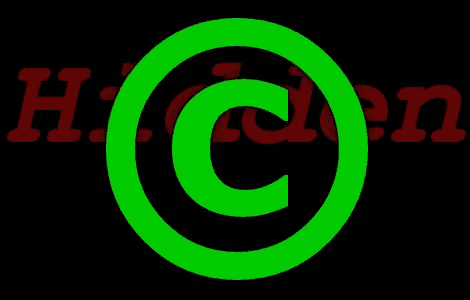

# STM32 演示代码携带额外(隐藏？)版权

> 原文：<https://hackaday.com/2012/06/19/stm32-demo-code-carries-extra-hidden-copyrights/>

最近，我启动了一个存储库，其中存放了一个模板[,该模板可用于通过 GCC 工具链编译 STM32F0 项目](http://hackaday.com/2012/06/17/template-for-building-stm32f0-discovery-project-in-gcc/)。我在组装时使用了 STM 的两个代码包，一个是发现板本身的固件，另一个是芯片系列的标准外设库。我阅读了这两个包根目录下的许可协议，我认为它们相当公平。基本上，协议是，只要代码只在 STM 硬件上使用，你就可以将它们用于任何目的。很公平。

你可以想象我当时很沮丧，所以看到[一位读者的评论](http://hackaday.com/2012/06/17/template-for-building-stm32f0-discovery-project-in-gcc/comment-page-1/#comment-683190)说我在回购中的一个文件侵犯了版权。似乎作为 Atollic 的 TrueSTUDIO 的例子给出的链接器脚本有它自己的*极其*严格的版权:

> ** (c)版权所有 Atollic AB。
> **您可以按原样使用该文件，也可以根据您的
> **项目的需要对其进行修改。本文件(未经修改或修改)的分发是不被
> **允许的。Atollic AB 允许注册的 Atollic TrueSTUDIO(R)用户将此
> **文件的汇编、编译&链接内容作为应用程序二进制文件的一部分进行分发，前提是它是使用 Atollic TrueSTUDIO(R)工具链构建的
> **文件。

首先，我只是因为在存储库中发布文件而违反了规则。但是读得更深入一点。任何使用 GCC 工具链编译的代码都会侵犯版权，除非是 Atollic 的工具链。

我的不满是 STM 在传播这个。为什么？为什么要将如此严格的东西放入一个有着如此合理许可证的软件库中呢？当然，STM 的许多工程师有能力编写一个链接器脚本，他们可以在自己的许可下发布，该脚本可以与 TrueSTUDIO 一起工作。此外，它还有一个额外的好处，就是允许其他基于 GCC 的工具链成为一种方便(合法)的链接代码的方法。

所以我已经把文件从存储库中完全删除了。如果你是在 github 上观看它的 10 个人之一，这有一个意想不到的后果，就是放弃了你的观看请求。与此同时，我正在努力学习如何编写自己的链接器。[这份关于皮质-M3 连接器的指南](http://fun-tech.se/stm32/linker/index.php)帮了大忙。如果你有能力贡献一个有效的链接器脚本，请在 github 发布一个拉请求或者提出一个问题[。](https://github.com/szczys/stm32f0-discovery-basic-template)