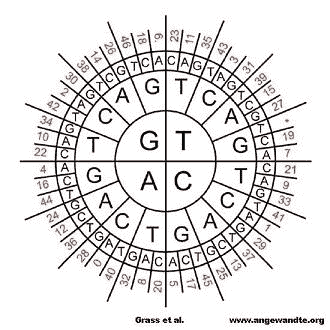

# 将数字文件储存在硅胶包裹的 DNA 中

> 原文：<https://hackaday.com/2015/02/21/store-digital-files-for-eons-in-silica-encased-dna/>

如果数字存储有一个缺点，那就是寿命短。尽管技术上尽了最大努力，超过 50 年的数字存储是极其困难的。瑞士苏黎世联邦理工学院的研究人员罗伯特·格拉斯等人决定用 DNA 来解决这个问题。让你成为“你”的东西也可以用来储存你的整个图书馆，甚至更多。

正如癌症的存在所表明的，DNA 并不总是被完美复制。一个碱基对的单个错配、添加或缺失都会对生物体造成严重破坏。[Grass 等人]认识到，为了长期存储能力，纠错是必要的。他们决定使用里德-所罗门码，这种码已经被用于许多存储格式的纠错，从 CD 到 QR 码到卫星通信。从 1291 年[瑞士联邦宪章](http://en.wikipedia.org/wiki/Federal_Charter_of_1291)的未压缩数字文本文件和[阿基米德重写本](http://en.wikipedia.org/wiki/Archimedes_Palimpsest)的英文翻译开始，他们将每两个字节映射到一个[伽罗瓦域中的三个元素。](http://en.wikipedia.org/wiki/Finite_field)每个元素被编码成一个特定的密码子，一个三联体核苷酸。此外，采用了两级冗余，为错误恢复创建了外码和内码。由于长 DNA 很难合成(且价格较高)，最终产物是 4991 个各含 158 个核苷酸的 DNA 片段(39 个密码子加引物)。

在加速老化实验中，DNA 暴露在高达 70℃的持续温度下一周，比较了包裹在二氧化硅中的 DNA 和其他干燥介质(如纸张或聚合物)上的 DNA。一周后，除了二氧化硅包裹的 DNA 外，其他 DNA 都发生了显著的降解。二氧化硅提供了与外部环境的完全隔离。[Grass 等人]指出，在二氧化硅中添加一层二氧化钛可以增加对光的保护，尤其是紫外线。因此，只有来自二氧化硅的 DNA 被测序和解码。解码从内码开始，纠正任何单个碱基错误。按照索引对序列进行排序。外部解码然后纠正整个序列中的任何错误或恢复丢失的错误。总体结果表明，硅胶不仅能最好地保存 DNA，而且纠错功能还能完美地保留原始数据。

加速老化试验的持续时间相当于 2000 年。额外的测试表明，将 DNA 储存在-18 摄氏度的硅胶中(如在全球种子库中的[)可以使其稳定超过 200 万年，比人类存在的时间还要长。潜在地，我们作为一个物种所产生的所有信息都可以储存在一个苏打瓶中。](https://www.croptrust.org/what-we-do/svalbard-global-seed-vault/)

虽然发表的文章只有[可以购买](http://onlinelibrary.wiley.com/doi/10.1002/anie.201411378/abstract)，但是[的补充信息](http://onlinelibrary.wiley.com/doi/10.1002/anie.201411378/suppinfo)是公开的，并且非常深入。我们被这项研究震惊了。有一件事是肯定的:我们再也不用担心阿基米德的重写本会被我们的后代当成糟糕的同人小说来读了！
【via[Reddit](https://www.reddit.com/r/science/comments/2w2gr7/a_hard_drive_made_from_dna_preserved_in_glass/)