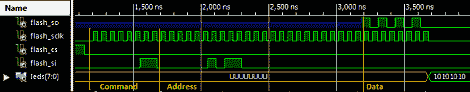

# 在 FPGA 上存储用户数据

> 原文：<https://hackaday.com/2012/10/16/storing-user-data-on-your-fpga/>

我们已经看到 FPGAs 被用来重建从经典街机游戏到古代电脑的一切，但是每一次重建都会出现一个共同的问题。一旦你在 FPGA 上完成了硬件仿真，你也必须将 rom 加入到项目中。在一次非常有趣的黑客攻击中，[Mike]发现存储 FPGA 设置的串行闪存芯片有很多空闲空间，所以[为什么不在那里存储用户数据呢？](http://hamsterworks.co.nz/mediawiki/index.php/Config_flash)

[Mike]看到我们上个月特别推出的经典 BombJack 街机游戏[的再现，产生了这个想法。在该建筑中，[Alex]需要存储 112Kb 游戏数据，这些数据存储在 16 个 ROM 芯片中。不幸的是，[Alex]的 FPGA 只能存储 40Kb 的数据。在意识到他的 FPGA 有一个 512Kb 的 SRAM 芯片后，[Alex]决定将所有的精灵、声音和炸弹杰克的级别都放在 SRAM 中。](http://hackaday.com/2012/09/05/building-a-classic-coin-op-game-in-an-fpga/)

[Mike]对[Alex]的构建印象深刻，开始将这种技术推广到其他项目中。[Mike]注意到只有少数 FPGA 板能够在配置比特流旁边存储用户数据；这种破解在 Digilent Basys2 板上是不可能的，但它在 Papilio One 250K 上运行得非常好。

作为一个非常酷的构建，它使 FPGA 相关的构建变得更加容易，我们必须向[Mike]致敬，他写了一个非常棒的教程。