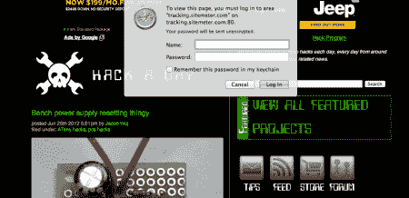

# Hackaday.com 奇怪的登录请求

> 原文：<https://hackaday.com/2012/06/25/strange-login-request-at-hackaday-com/>

我们在网站上收到了许多关于这个新的登录弹出窗口的消息。这不是我们做的。它很可能是来自我们古老模板的一些古老的手稿，最终变得过时或过期。我们正在努力解决。如果你点击取消，它会消失。

对于给您带来的不便，我们深表歉意，并正在努力立即解决此问题。

**更新:**没了。是 sitemeeter 的一个站点统计脚本突然在很多站点上出现了问题。我们非常努力地确保我们的广告不引人注目，因为我们依赖这些广告来支持我们。任何妨碍你阅读我们网站的东西都是不好的。