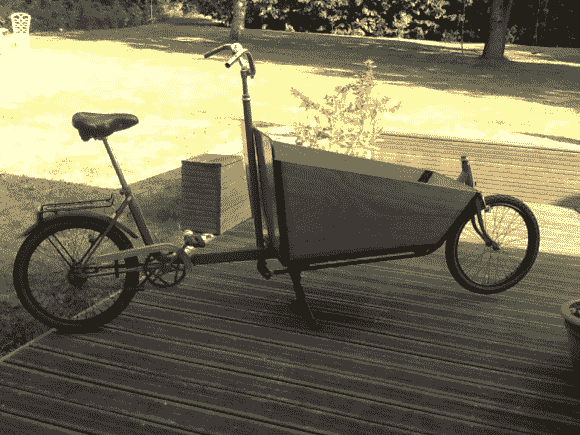

# 弹力自行车拉所有

> 原文：<https://hackaday.com/2014/04/01/stretch-bike-hauls-all/>

需要搬些东西吗？没有东西可以拖吗？然后给自己打造一辆[货运自行车](http://simplecargo.blogspot.de/)！我们以前见过[货运自行车](http://hackaday.com/2013/01/24/wooden-cargo-bicycle/)，但是没有一辆像这辆一样。由一辆德国“klapprad”打造而成，[Morgan]和他的父亲打造了一辆构造精良的货运自行车，它肯定会在很多年里派上用场。

他们首先将自行车切成两半，然后焊接一个 1 米长的方管。klapprad 风格的自行车是由厚金属股票，使其坚固，易于焊接。这一过程也使它成为一个真正的“拉伸”车辆，而不是取代前端的[车辆，以保持车把组件靠近骑车人。](http://hackaday.com/2011/10/01/incredibly-cheap-upcycled-cargo-bike/)

除了一些精致的木制品和碳纤维，他们还使用了一辆旧山地车的部件，包括前叉、前轴承和车把，一盏旧钢灯的管子，一辆邮差摩托车的支架，~~和一个厨房水槽~~来完成建造。只要货物的重量不超过司机的重量，它应该能很好地操纵。