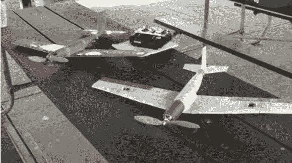

# 学生构建 3D 打印平面

> 原文：<https://hackaday.com/2013/09/13/students-build-a-3d-printed-plane/>

一个学生团队已经成功设计、建造并飞行了一架 [3D 打印的遥控飞机](http://wbi-icc.com/students/dmav/)，仅用了 16 美元的塑料和一台消费级 3D 打印机(Makerbot)，外加必要的电子设备和马达。

莱特兄弟研究所(WBI)的人们有一个名为 [AFRL 发现实验室](http://www.virtualdiscoverycenter.net/about/)的伟大计划，它将学生、企业、研究人员和政府团队聚集在一起，共同应对特定的挑战或机遇。

今年的项目之一是一次性微型飞行器，简称为“T1”。实习生【内森、本和布莱恩】在 tec^edge[花了前 5 周设计飞机。这个团队经历了 5 次修改，最终确定了一个他们认为可以飞行的设计。最后一架飞机重 1.5 磅，在它的第一次飞行中……一头栽进了地面。还好他们印了第二份！经过更多的练习，斯蒂芬掌握了窍门，能够成功地驾驶和降落飞机。](http://wbi-icc.com/centers-services/tecedge-icc)

根据 WBI 的说法，这是第一架使用 FDM 技术完全 3D 打印(无电子设备)的功能性飞机，也是第一架将要飞行的低机翼 3D 打印飞机。我不想打破他们的幻想，但是 3D 打印的四轴飞行器已经存在很长时间了！

休息之后是试飞视频。

[https://www.youtube.com/embed/07SNMN0Q8xA?version=3&rel=1&showsearch=0&showinfo=1&iv_load_policy=1&fs=1&hl=en-US&autohide=2&wmode=transparent](https://www.youtube.com/embed/07SNMN0Q8xA?version=3&rel=1&showsearch=0&showinfo=1&iv_load_policy=1&fs=1&hl=en-US&autohide=2&wmode=transparent)

[感谢极客匿名]