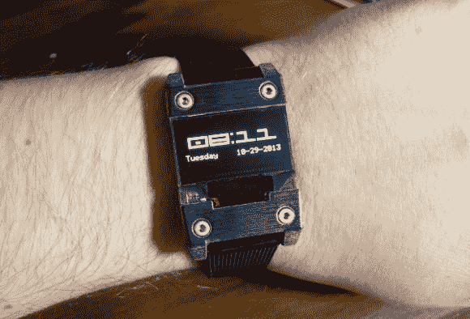

# 时尚的有机发光二极管手表使用加速度计而不是按钮

> 原文：<https://hackaday.com/2013/12/17/stylish-oled-watch-uses-accelerometer-instead-of-buttons/>

几天前,[Andrew]联系我们，为设计 [mooltipass 项目](http://hackaday.com/tag/mooltipass/)外壳提供帮助。在介绍自己的时候，他不经意地提到了[他的有机发光二极管手表](http://voodoomanmiracle.com/wp/?p=127)，你可以在上面看到。

该手表基于德州仪器的低功耗 MSP430F 微控制器。在保持实时时钟和监控中断的同时，它的功耗仅为 1.5uA。它还使用[铁电 RAM](http://en.wikipedia.org/wiki/Ferroelectric_RAM) ，不需要任何电源来保留其存储内容。这意味着，如果您卸下为手表供电的 CR2016 电池，就无需再次设置时间。

[Andrew]选择了一个 0.96 英寸的有机发光二极管显示屏，功耗高达 7mA。他还包括一个加速度计，允许他通过单次和两次点击检测功能与手表进行交互。他用 EagleCAD 对 PCB 建模，用 Sketchup 对整个组件建模。大多数元件都是在他的回流焊(烤面包机)炉中焊接的。最终结果是只有 8.8 毫米厚，在我们看来非常专业。