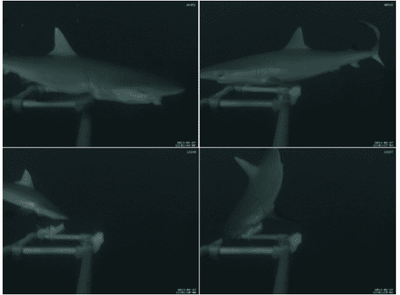

# 潜水相机拍下海洋掠食者的照片

> 原文：<https://hackaday.com/2013/05/22/submersible-camera-snaps-pics-of-ocean-going-predators/>

这个摄像装置[使用树莓派将摄像机向下发送五十米](http://rlab.org.uk/wiki/Long_Term_Deep_Water_Monitoring_from_the_Chagos_Achipelago)(RPi 博客上的[镜子](http://www.raspberrypi.org/archives/4015))以便窥探鲨鱼。一开始我们真的很兴奋，以为它可能会使用 Raspberry Pi 基金会的相机模块，但事实并非如此。请继续读下去，这本书里有很多很酷的东西。

该项目利用分布在大面积上的一系列照相机来监测鲨鱼的活动。每个都安装在一个固定的浮标上，使用太阳能电池板和铅酸凝胶电池供电。RPi 本身保留在顶部的防水盒中。它使用 50 英尺的以太网跳线连接到摄像机。

我们认为建造硬件的挑战与设计水下机器人的挑战是一样的。相机需要一个外壳，能够承受住该深度的压力，同时允许电缆穿过。在项目日志中还有一个有趣的注释，关于如何让相机曝光设置正常工作。