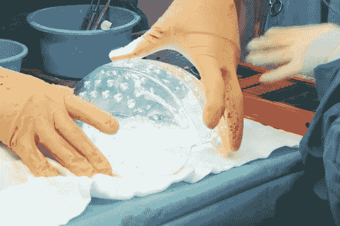

# 成功的 3D 打印颅骨植入物

> 原文：<https://hackaday.com/2014/03/28/successful-3d-printed-cranium-implant/>

我们生活在一个怎样的时代。如果上面的图像看起来像整个头骨——那是因为它就是。外科医生成功地用这个塑料复制品替换了一名 22 岁女子的头盖骨。

我们以前见过小型 3D 打印移植物，但没有像这样大的。一名 22 岁的女性患有一种非常罕见的疾病，她的头骨从未停止生长。正常人的头骨大约有 1.5 厘米厚，而她的头骨在手术时几乎有 5 厘米厚。如果他们再拖下去，持续的骨骼生长最终会杀死她。

到目前为止，这种手术需要一个手工制作的类似混凝土的植入物来代替被切除的骨头。你可以想象，这几乎不是一个理想的解决方案。得益于不断进步的 3D 打印技术，UMC 乌得勒支大学的外科医生能够用耐用、轻便的透明塑料制造出一个精确的复制品，这也比旧的方法有更好的大脑功能恢复速度。

这个 23 小时的手术发生在去年 12 月，取得了巨大的成功，患者完全康复——如果你对暴露的大脑不太敏感，可以看看下面的视频。哇哦。

[https://www.youtube.com/embed/IXcz3OdHSHk?version=3&rel=1&showsearch=0&showinfo=1&iv_load_policy=1&fs=1&hl=en-US&autohide=2&wmode=transparent](https://www.youtube.com/embed/IXcz3OdHSHk?version=3&rel=1&showsearch=0&showinfo=1&iv_load_policy=1&fs=1&hl=en-US&autohide=2&wmode=transparent)

【谢谢凯尔！]