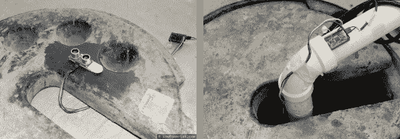

# 排水泵警报在水位上升时发送短信

> 原文：<https://hackaday.com/2013/04/30/sump-pump-alarm-sends-text-message-as-water-rises/>

我们有些朋友有两个排水泵。一个是备用的，开机时会发出警报声。但这只有在他们在家听的时候才有用。费利克斯·鲁苏想出了一个解决方案，如果排水泵出现故障，他会收到一条短信。这样他可以回家，或者如果他不在的话，打电话给某人检查问题。

我们在一月份看到了一个非常复杂的监控系统。这个使用了一个超声波测距仪，我们认为这要简单得多。它可以精确到大约 1 厘米，而且使用简单——它在爱好电子产品的人群中非常受欢迎，这有助于降低样本代码的价格和可用性。我们对在项目中使用 Raspberry Pi 板犹豫不决。一方面，这是一种将传感器接入网络的廉价方式，并提供了发送任意数量警报所需的基础设施。另一方面，对于这个特定的应用程序来说，这是一个很大的功率。但我们认为它可以扩展到监控(费利克斯的)家中的其他设施，比如一个提醒他热水器漏水的传感器。我们认为，每个人都会认为，像这样的显示器值得他花费时间和精力来开发它。