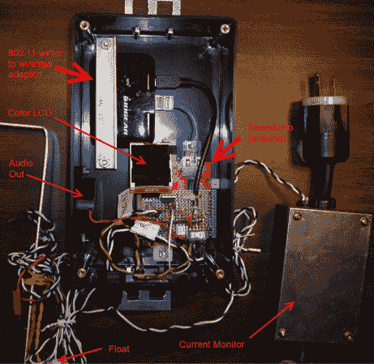

# 排水泵监控器发送电子邮件，并在水位上升时发出警报

> 原文：<https://hackaday.com/2013/01/03/sump-pump-monitor-emails-and-raises-alarm-if-water-rises/>

[马特]真的发现自己陷入了困境。他的污水井里有一层浮油。这些井与排水砖一起工作，将水从房子的地基抽走。不幸的是，用来防水他的地基外部的柏油也被冲进了污水坑，把工程搞糟了。如果排水泵出了问题，他建造的系统会发出声音警报并发送电子邮件。

他在监视两个不同的问题。一种技术使用浮阀来感应水位是否过高，发出信号表明控制水泵的机构发生了故障。另一个是电流监测器，它检测排水泵是否已经运行太长时间(由排水泵的水传感器卡在开启位置引起)。他不想做的一件事是直接控制水泵，因为他代码中的一个错误很容易导致地下室被淹。当考虑[建造一个 DIY 恒温器](http://hackaday.com/2011/04/22/rule-your-furnace-with-this-network-enabled-thermostat/)时，我们也有同样的担忧(一个错误可能意味着冻结的水管导致洪水)。