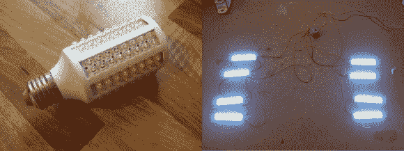

# 超级实惠的 LED 照明，无需电源电压

> 原文：<https://hackaday.com/2014/04/13/super-affordable-led-lighting-ready-to-go-off-mains-voltage/>

如果你正在寻找一个超级便宜的方法来为你的房子增加 LED 照明，那么这个软件就是为你准备的！几美元就可以买到玉米棒样式的 LED 灯泡。灯泡包括驱动电路和 8 个 LED 阵列！你所要做的就是把它拆开。

[Martin Raynsford]在试图想办法点亮他的激光雕刻外壳时偶然发现了这个想法。它原本配有一个普通的灯泡，但它不能很好地分配光线，并且妨碍了他其他一些计划中的升级。

他不想再增加一个 DC 电源，他记得他有一个旧的玉米棒 LED 灯泡——事实证明，它们很容易拆卸！焊接一些更长的引线(注意它们是如何连接的，有些是串联的，有些是并联的)，你就可以自己制作一些易于使用的 LED 重点照明了！

当然，你现在可以从中国购买那些便宜的 LED 灯卷，几乎不用花什么钱来做你的重点照明。

[via [被黑的小工具](http://hackedgadgets.com/2014/04/10/corn-cob-led-reuse/#section1')