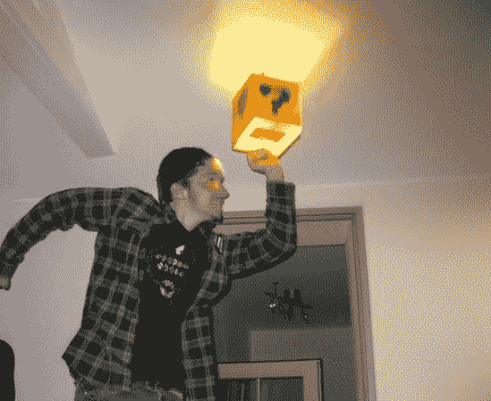

# 超级马里奥灯鼓励身体活动

> 原文：<https://hackaday.com/2014/02/11/super-mario-lamp-encourages-physical-activity/>

有什么比添加[你自己的超级马里奥风格的问题积木灯更好的方式来鼓励在房子里跳来跳去呢？](http://www.instructables.com/id/super-mario-lamp/)

这是一个有趣又简单的项目，因为它使用了宜家 Sangen 灯，只需稍加修改和一点艺术加工，就能变成这个标志性的问题积木。不过，你将在市电电压下工作，所以请小心！

灯具本身由织物制成，这意味着它可以轻松拆卸，然后染成经典的橙色。使用模板，你可以在问号上喷漆，然后只需添加一个弹性锁定压力开关(这是他们的专业术语，对吗？)与灯泡成一直线。结果可能会有所不同，但[Anred]有一个很好的指导，告诉你如何开始。

现在只差一个音效来配合开关了！

[https://www.youtube.com/embed/FDz1lud5odU?version=3&rel=1&showsearch=0&showinfo=1&iv_load_policy=1&fs=1&hl=en-US&autohide=2&wmode=transparent](https://www.youtube.com/embed/FDz1lud5odU?version=3&rel=1&showsearch=0&showinfo=1&iv_load_policy=1&fs=1&hl=en-US&autohide=2&wmode=transparent)

或者如果你真的想做得更好——看看这个超级马里奥硬币方块黑客，[它真的会向你吐硬币！](http://hackaday.com/2011/03/23/real-life-super-mario-coin-block/)