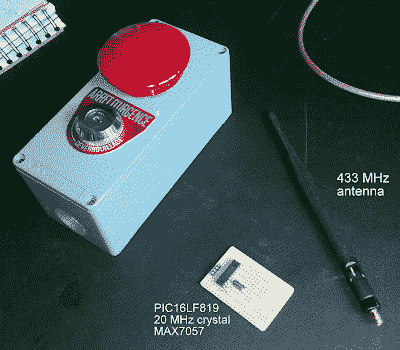

# 超级严肃的车库门开启器

> 原文：<https://hackaday.com/2012/10/24/super-serious-garage-door-opener/>

厌倦了廉价的塑料车库门开门器？[Yetifrisstlama]的可能是我们见过的最严肃的车库门开启器。外壳是一个旧的紧急停止开关，它有足够的空间来放置电路，并有一个大的红色按钮。

这个构建日志从逆向工程原始开门器协议的细节开始。这是一个[幅移键控](http://en.wikipedia.org/wiki/Amplitude-shift_keying "Amplitude Shift Keying") (ASK)信号，发送一个 10 位代码进行认证。内部的主要元件是 PIC16LF819 微控制器、MAX7057 ASK/FSK 发射器和一些过滤信号所需的 RF 电路。原型板上混合安装了通孔和表面贴装元件，需要一些巧妙的焊接。

[Yetifrisstlama]说下一步是增加一个功率放大器来增加范围。代码和项目文件也提供给任何有兴趣使用 ASK 的人。虽然黑客看起来很棒，但它可能会让旁观者认为你在做比打开车库门更邪恶的事情。