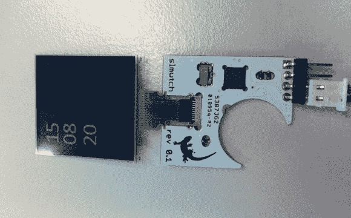

# 超薄腕表型

> 原文：<https://hackaday.com/2012/12/12/super-slim-wristwatch-build/>

这款[SLM watch 名副其实](http://blog.energymicro.com/2012/12/12/make-a-slim-watch-with-arm-cortex-m3-efm32/)。当 LCD 屏幕折叠到 PCB 上时，整个东西只有 2.35 毫米。这包括上面没有显示的硬币电池。哇！

使这成为可能的部分原因是特殊的 PCB 设计。[Anders]不想增加屏幕和电池以外的厚度，所以他在 PCB 设计中做了一个切口来容纳每个组件。在此图中，最容易看到左上角的两个 SMD 电阻。它们被两个焊接点固定在一个空隙中。诚然，这不会是一个大规模生产友好的设计。我们有关于通过引线悬挂元件的长期稳定性的音乐会。但作为一次性的，这太棒了！休息后在视频里自己看吧。

手表的控制使用 PCB 背面的两个触摸感应垫。显示器没有背光，这在户外试图读取时间时会是一个问题。我们想知道是否有类似尺寸的 ePaper 显示器？

[https://www.youtube.com/embed/o0938_LIzvs?version=3&rel=1&showsearch=0&showinfo=1&iv_load_policy=1&fs=1&hl=en-US&autohide=2&wmode=transparent](https://www.youtube.com/embed/o0938_LIzvs?version=3&rel=1&showsearch=0&showinfo=1&iv_load_policy=1&fs=1&hl=en-US&autohide=2&wmode=transparent)