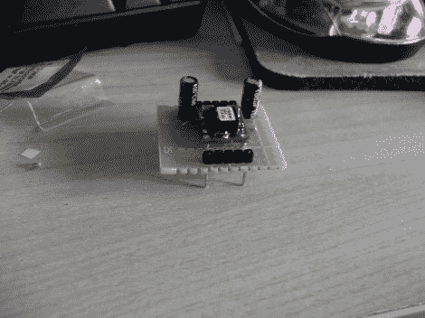

# PTH08080 的开关模式试验板电源

> 原文：<https://hackaday.com/2012/09/03/switch-mode-breadboard-supply-from-a-pth08080/>

[Ben]想要为他的试验板提供一个开关模式电源。他订购了一个德州仪器制造的 PTH08080 模块。规格表对他来说是一个很好的选择，但他不高兴得知引脚排列不符合无焊试验板使用的 0.1”间距。他的解决方案是用一些原型板制作一个突破适配器。

PTH08080 可以提供高达 2.25A 的电源。它接受 4.5-18V 输入，可以输出 0.9-5.5V。与线性稳压器相比，开关模式电源的效率更高。该设计增加了两个电容，数据手册 (PDF)中的[应用电路建议使用这两个电容。请注意，分线板上有两个接头。一个为试验板提供电源和接地。另一个给他一个地方连接用来选择输出电压的调节电阻。这连接在 PTH08080 的一个引脚和 GND 之间。[Ben]计划升级设计，包括一个精密 trimpot，以便轻松调整输出电压。](http://www.ti.com/lit/ds/slts235c/slts235c.pdf)