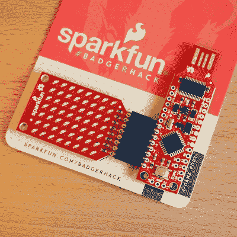
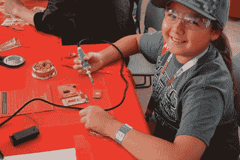

# SXSW Create: Sparkfun 给孩子们很棒的徽章去黑

> 原文：<https://hackaday.com/2015/03/19/sxsw-create-sparkfun-gives-kids-awesome-badges-to-hack/>

迄今为止，SXSW Create 上最受观众欢迎的展台是 Sparkfun 象限。我们称之为象限，因为他们的占地面积接近帐篷面积的 1/4，但它得到了很好的利用。他们带了一些工作人员到奥斯汀来分发一个合法的电子徽章项目，他们称之为 BadgerHack。

 我们[爱](http://hackaday.com/2014/08/07/hands-on-defcon-22-badge/)徽章窃听。[爱死了](http://hackaday.com/2014/08/08/defcon-22-badge-talk/)！但是 South-by 并不纯粹是一个硬件会议，所以徽章不是由 PCB 制成的(真丢人)。除此之外，免费进入创造分数你一个腕带，但没有徽章。

这就是答案，一个针对孩子们的徽章赠品，但足够酷，让我觉得接受一个徽章有点可怕，因为我很清楚他们会在最后一天结束前用完。

正如你所猜测的，USB 记忆棒 PCB 是一种 Arduino 兼容产品，装载了 FTDI 芯片和 ATmega328p，他们称之为 BadgerStick。与之配套的是一个多路复用 8×7 LED 矩阵板。焊接三个引脚头和电池座引线，使用随附的双面胶带连接到塑料徽章，您就有了一个以 led 滚动消息的徽章。

 多么令人敬畏的赠品。我真的很喜欢他们没有在这里偷工减料。首先，孩子们会更加重视徽章，因为他们必须实际组装它，而不仅仅是得到一个成品。其次，有 USB 到串行芯片和 USB 足迹，这意味着他们可以重新编程，而不需要任何额外的设备。还有 LED 矩阵…拜托，那只是学习[布线](http://www.arduino.cc/en/guide/introduction)的入门药物。Bravo Sparkfun 和 Atmel 用你的营销资金走这条路。

徽章活动以一些硬件接口完成。有一个 3 针插座，与会者可以插入展台周围的 4 个不同的工作站。一旦完成，他们就会收到 Sparkfun 的优惠券代码，每当徽章启动时就会滚动。对于一些在家的乐趣来说，BadgerHack 固件的文章(链接在顶部)相当不错。它提供了改变徽章上显示内容的建议，并概述了如何只需增加一点硬件就能构建一个*突围*游戏。

[https://www.youtube.com/embed/qAIXJasd54c?version=3&rel=1&showsearch=0&showinfo=1&iv_load_policy=1&fs=1&hl=en-US&autohide=2&wmode=transparent](https://www.youtube.com/embed/qAIXJasd54c?version=3&rel=1&showsearch=0&showinfo=1&iv_load_policy=1&fs=1&hl=en-US&autohide=2&wmode=transparent)