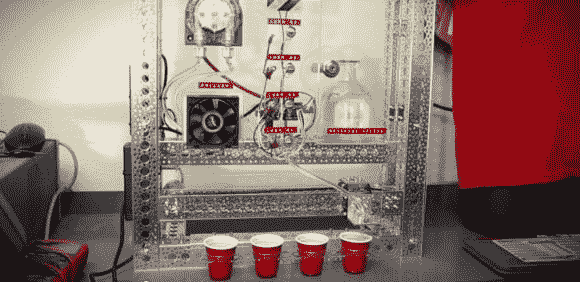

# 增效器:紧急交钥匙机器人

> 原文：<https://hackaday.com/2014/05/25/synergizer-the-emergency-key-turn-barbot/>

今天在办公室过得很糟糕。你需要休息。但是你自己？不，你需要的是被增效！只有当四把钥匙都插入并转动时，这款 Barbot 才会工作——有点像核发射程序——只有这样，它才会分发四杯大小完美的饮料，让你的一天更美好。

增效器使用 Arduino 来控制皮带驱动的线性致动器，该致动器将壶嘴从一个杯子移动到另一个杯子。沿着长度方向的一系列簧片开关向系统提供反馈，用于位置控制。这种机器利用一种叫做 Bartendro 分配器的蠕动泵，将你选择的液体精确地泵入每个杯子。蠕动泵最酷的一点是它们是自吸式的，每次都能泵出精确量的液体。

设计师尼克·普尔(Nick Poole)还包括一个 CPU 风扇和散热器，与珀尔帖板配对，以便在泵送液体时冷却液体。为了使它更有趣，他添加了一个四键覆盖，所以只有当所有四个唯一的键都被插入时，增效器才能被使用。

[https://www.youtube.com/embed/7G7K2xieoRs?version=3&rel=1&showsearch=0&showinfo=1&iv_load_policy=1&fs=1&hl=en-US&autohide=2&wmode=transparent](https://www.youtube.com/embed/7G7K2xieoRs?version=3&rel=1&showsearch=0&showinfo=1&iv_load_policy=1&fs=1&hl=en-US&autohide=2&wmode=transparent)

对于一个多液体的 barbot，你必须看看这个由[Sean Carney]设计的光滑的建筑——它甚至可以通过任何设备访问网络进行控制！