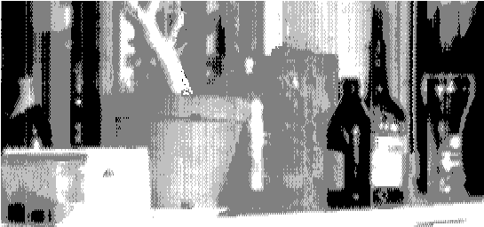

# 用 DRAM 芯片拍照

> 原文：<https://hackaday.com/2014/04/05/taking-pictures-with-a-dram-chip/>

这张照片是由[使用 DRAM 芯片作为图像传感器](http://www.kurzschluss.com/kuckuck/kuckuck.html) ( [翻译](http://translate.google.com/translate?sl=auto&tl=en&js=y&prev=_t&hl=en&ie=UTF-8&u=http%3A%2F%2Fwww.kurzschluss.com%2Fkuckuck%2Fkuckuck.html&edit-text=))拍摄的。一个去盖的 64k DRAM 芯片与可以将图像聚焦到管芯上的光学器件结合在一起。通过从 DRAM 中读取数据，可以构建图像。

[DRAM](http://en.wikipedia.org/wiki/Dynamic_random-access_memory) 是您在插入主板的 RAM 卡上找到的 RAM 类型。它由大量的电容器和晶体管组成。每一位需要一个晶体管和一个电容，效率相当高。缺点是存储器需要定期刷新，以防止电容放电。

将电容器暴露在光线下会使其放电更快。一旦放电超过某个阈值，该位将从 1 翻转到 0。为了拍照，将 1 写入 DRAM 阵列中的每一位。通过计时一个比特从 1 翻转到 0 需要多长时间，可以确定曝光量。由于 DRAM 是以阵列的形式布置的，因此每一位都可以被视为一个像素来重建图像。

当然，现代 CCD 更好，更便宜，更快，但这种黑客是一种完全重新利用芯片的巧妙方法。如果你想重建这个项目，甚至还有 Turbo Pascal 源代码。

感谢[svofski]的提示。