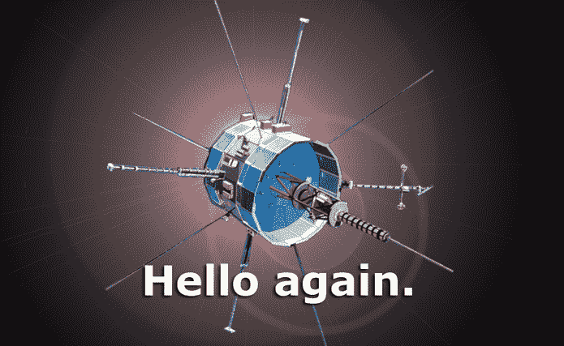

# 与 ISEE 交谈-3

> 原文：<https://hackaday.com/2014/05/29/talking-to-isee-3/>

ISEE 3 号，这个勇敢的星际飞船由成千上万众筹支持者的梦想和肼[提供燃料，现在正在向地球传输数据](http://spacecollege.org/isee3/we-are-now-in-command-of-the-isee-3-spacecraft.html)。

今年所有与 ISEE 3 号的无线电联系都只是载波频率，reboot 项目的人员已经成功地通过巨大的阿雷西博望远镜指挥 ISSE 将数据传输回地球。德国、肯塔基州和加利福尼亚州的地面站现在以 512 位/秒的速度接收可用数据，ISEE 重启项目的工程师们肯定正在查看这些数据。

简单地发送命令，使数据多路复用器进入工程遥测模式并不是一件小事；需要建造一个功率放大器，运到阿雷西博，并安装在阿雷西博碟形天线上方的巨型穹顶中。放大器是在地震发生的最后一天[才安装的，更不用说](http://www.youtube.com/watch?v=HyYivyVZzT4)了。

在这个项目进一步发展之前，还有许多工作要做；该团队将需要从收到的数据中检查航天器的状态，将检查更多的系统，最终航天器将被命令用其小型推进器进行 17 小时的燃烧，使其在 8 月份的某个时候被地球捕获。

进行这种规模的交流是一项惊人的成就，现在 ISEE 3 号任务时间表中的事件将会很快发生。我们正试图组织一个视频/博客/演职人员与来自 NASA 埃姆斯或莫尔黑德州的团队合作，但可以理解的是，这个团队现在有点忙。