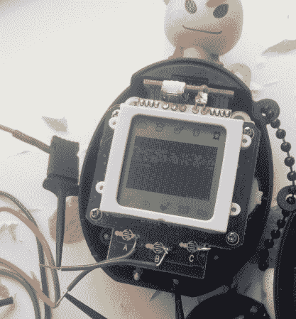

# 电子鸡来自转储和逆向工程

> 原文：<https://hackaday.com/2013/05/24/tamagotchi-rom-dump-and-reverse-engineering/>

通常，成功的真正关键是坚持，这个项目也是如此，这个项目[抛弃了当前一代电子鸡玩具](http://www.kwartzlab.ca/2013/05/first-glimpse-soul-tamagotchi/)的 ROM。如果你喜欢了解消费电子产品的内在秘密——你知道*我们*也是——你会想回去[看看【娜塔莉·席尔瓦诺维奇】去年做的 29C3 的 24 分钟电子鸡黑客讲座](http://hackaday.com/2012/12/31/tamagotchi-hacking-in-depth/)。她在破解可玩吊舱方面取得了相当大的进展，但无法从通用 Plus 板载芯片处理器上获得完整的 ROM 转储。这一更新预示着她的成功，并分享了如何做到这一点的细节。

正如我们从视频讲座中了解到的那样，光是弄清楚它使用的是什么处理器就已经是一件非常麻烦的事情了。它原来是一个 6502 内核，内置了一些其他东西。在搜索了制造商的网站后，她找到了用于写入端口 a 的示例代码。[然后，她能够执行自己的代码](http://www.kwartzlab.ca/2013/05/code-execution-tamagotchi/)，该代码旨在使用 SPI 协议一次转储一个字节的 ROM。

[Natalie]发布了她的代码转储，如果你有兴趣的话。但是像往常一样，我们认为旅程是最有趣的部分。

[谢谢意大利]